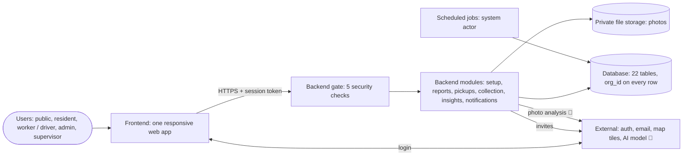
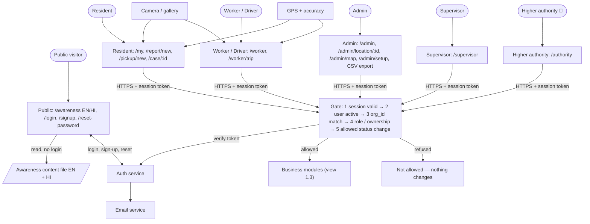
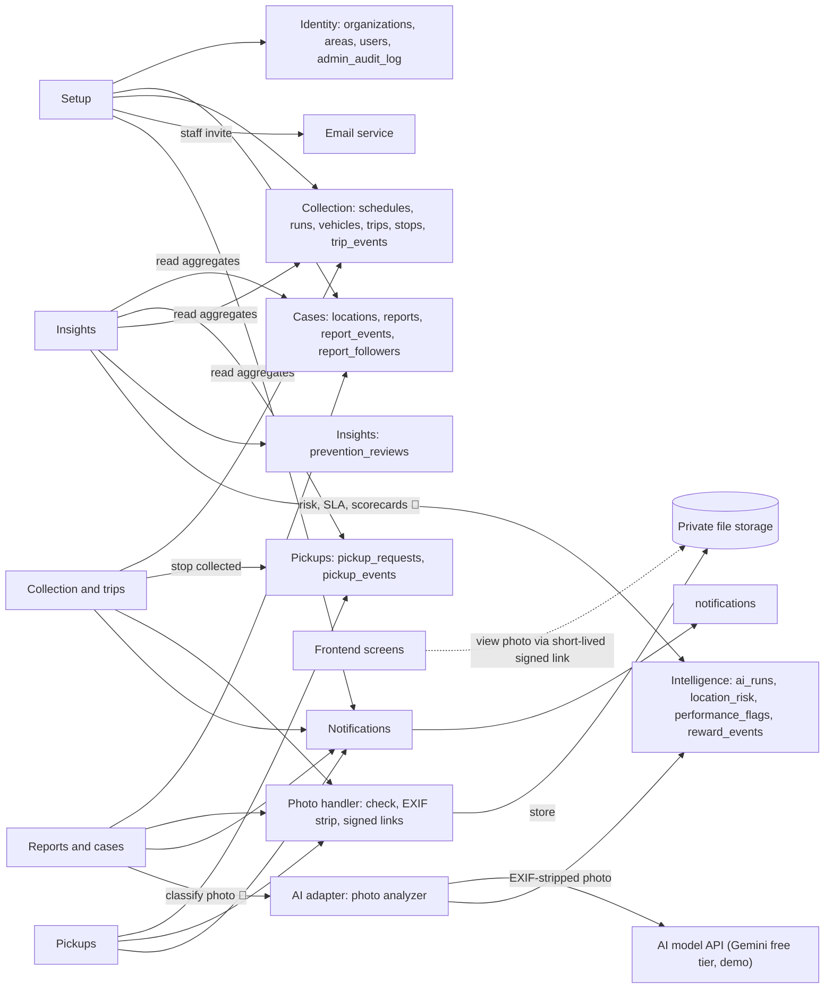
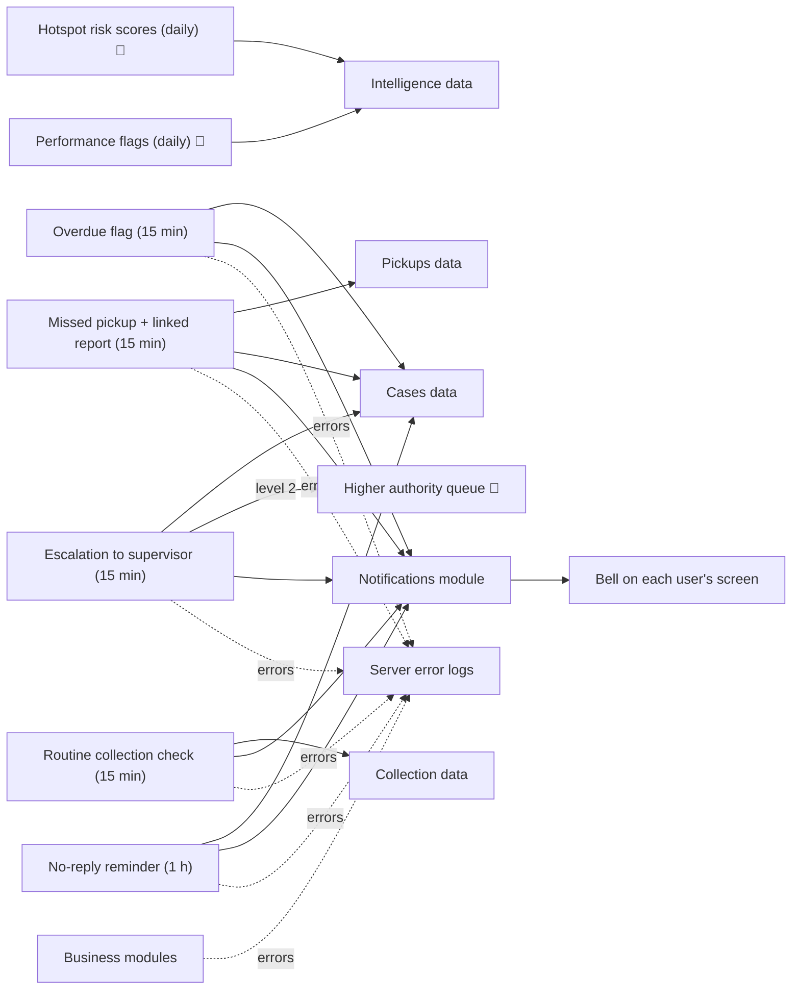
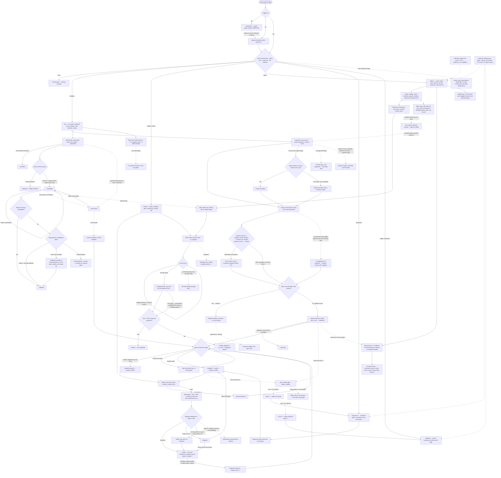
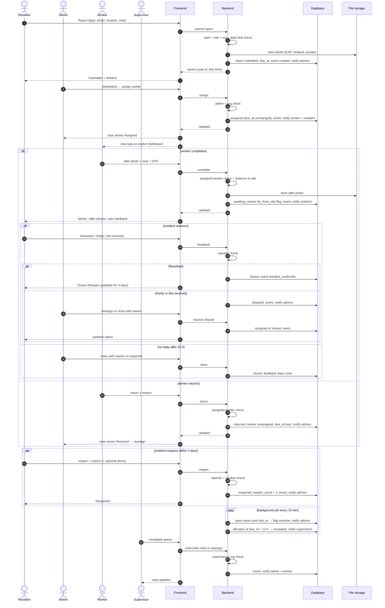
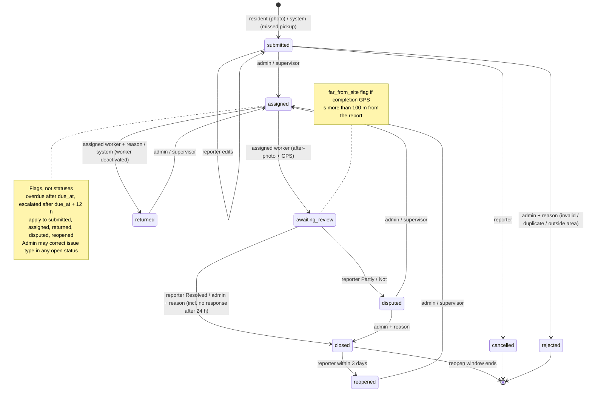
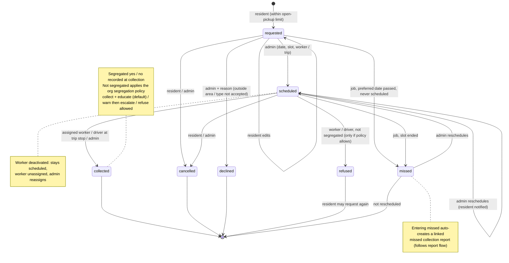
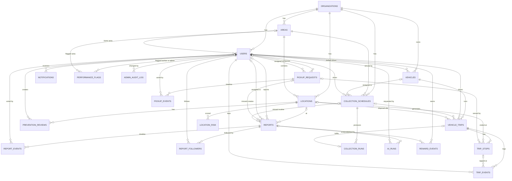

# Full App Flow — Frontend ↔ Backend ↔ Database

**Builds on:** [02-PRD.md](02-PRD.md) and the problem statement. One document for the whole system: what the user sees (frontend), what the server checks and does (backend), and what is read or saved (database and services). **Stack-agnostic**; the Tech Stack document is chosen from section 10.
**Legend:** (demo) = sample setting stored per organisation, not validated policy · 🆕 = added in the v2/v3 audits · ♻️ = restored in v3 from the earlier version · 🧠 = AI and intelligence additions (v4), detailed in [05-AI-SPEC.md](05-AI-SPEC.md).

**Contents:** 1 Architecture · 2 Roles · 3 Global rules · 4 Flows F1–F12 · 5 Core sequence · 6 Status diagrams · 7 Permissions · 8 Data model · 9 Background jobs · 10 Stack requirements · 11 Demo data · 12 Decisions and default settings

---

## 1. System architecture

**How this section is organised (v3.1 🆕):** four small **views** for people to read (1.1–1.4), a plain-language **how it works** (1.5), the **components table** (1.6), and the **full reference diagram** (1.7). The views only split the full diagram into readable parts: same components, same names, no new data. **1.7 is the source of truth.** If anything changes, update 1.7 first, then the view that shows it.

### 1.1 Overview — the whole system in one look



### 1.2 View — users, screens and access



### 1.3 View — backend modules and data



### 1.4 View — background jobs, notifications and logs



### 1.5 How it works (plain language)

**A normal user action** (e.g. resident submits a report):
1. The user acts on a screen; the device may add a photo and GPS.
2. The frontend sends the request with the session token over HTTPS.
3. The gate runs 5 checks. Any failure → "Not allowed", nothing changes.
4. The right module does the work (here: Reports and cases).
5. Photos go through the photo handler → private storage.
6. The module saves rows (always with `org_id`) and a timeline event.
7. The module asks Notifications to alert the right people.
8. The backend answers the frontend; the screen shows the new status. Other users see it on their next refresh or live update.

**Login:** the frontend talks directly to the auth service (password never touches our database). The auth service gives a session token; the gate verifies it on every request.

**Background work:** scheduled jobs run without a user, as the *system* actor. They read data, set flags or statuses (overdue, escalated, missed, routine run), write events with `actor = system`, and notify people.

**Photos:** upload goes screen → gate → module → photo handler → private storage. Viewing uses a short-lived signed link, so photos are never public.

**Awareness:** a static page reading a content file; no login and no backend.

**Errors:** modules and jobs write failures to server error logs, never passwords or photo links.

### 1.6 Components and responsibilities


| Component | Does | Used by flows |
|---|---|---|
| Public pages | Awareness (static, no backend), login, sign-up, reset | F1, F10 |
| Role screens | One set of screens per role; the bell and demo label on every page | F2–F12 |
| Auth service | Stores hashed passwords, issues and verifies session tokens, triggers reset emails | F1 |
| Gate | The 5 checks on every request; failure returns "Not allowed" and changes nothing | all |
| Setup module | Settings, locations and areas, people (with invite email), vehicles, schedules; deactivation returns open cases | F2 |
| Reports and cases module | Whole report lifecycle, followers, type correction, rejection | F3, F4 |
| Pickups module | Pickup lifecycle and segregation policy | F6 |
| Collection and trips module | Trips, stops, taps, routine collection runs | F9, F12 |
| Insights module | Dashboards, area overview, service measures, hotspots, prevention reviews, CSV export (read-mostly) | F7, F8 |
| Notifications module | Writes, lists and marks notifications read | F11 |
| Photo handler | Validates, strips EXIF, stores privately, issues signed links | F3, F4, F6, F9 |
| Scheduled jobs | Run as the system actor (no user session); every change writes an event with `actor = system` | F5, F6, F12 |
| Database | 22 tables in 7 groups (incl. 🧠 intelligence, 🆕 pickup_events, 🆕 admin_audit_log); every query is filtered by `org_id` | all |
| File storage | Private photos; readable only through short-lived signed links | F3, F4, F6, F9 |
| Email service | Password reset and staff invites only | F1, F2 |
| Map tiles provider | Background map for pins and trips | F3, F8, F9 |
| Server error logs | Record failures for debugging; no passwords or photo links logged | all |
| Hosting 🆕 | Serves frontend and backend over HTTPS; secrets only in environment variables, never in code | all |
| Seed script 🆕 | Loads the labelled demo data (section 11) for both organisations | setup |
| AI adapter 🧠 | Sends the EXIF-stripped photo to the AI model, validates the JSON answer, falls back to manual on error, logs `ai_runs`; provider switchable | F3, F10, F13 |
| AI model API 🧠 | Gemini free tier for the demo; content may be used by the provider, so demo photos only | F3, F10 |
| Intelligence jobs 🧠 | Daily hotspot risk scores and performance flags; level-2 escalation inside the escalation job | F5, F13 |
| Higher-authority screens 🧠 | Level-2 escalations, scorecards, flags; read-only apart from flag outcomes and notes | F13 |

### 1.7 Full reference diagram (source of truth, for AI and developers)

```mermaid
flowchart TB
  subgraph USERS["Users"]
    U_PUB([Public visitor])
    U_RES([Resident])
    U_WRK([Worker / Driver])
    U_ADM([Admin])
    U_SUP([Supervisor])
    U_HA([Higher authority 🧠])
  end

  subgraph DEVICE["Device / browser"]
    CAM[Camera / gallery]
    GPS[GPS + accuracy]
    LS[Browser storage: language choice]
  end

  subgraph FE["Frontend — one responsive web app over HTTPS"]
    FE_PUB["Public: /awareness EN/HI, /login, /signup, /reset-password"]
    FE_RES["Resident: /my, /report/new, /pickup/new, /case/:id"]
    FE_WRK["Worker / Driver: /worker, /worker/trip"]
    FE_ADM["Admin: /admin, /admin/location/:id, /admin/map, /admin/setup, CSV export"]
    FE_SUP["Supervisor: /supervisor"]
    FE_HA["Higher authority: /authority 🧠"]
    FE_BELL["Shared: notification bell, Demo data label"]
  end

  CF[/"Awareness content file EN + HI, each item with source"/]

  subgraph BE["Backend API"]
    GATE["Gate: 1 session valid → 2 user active → 3 org_id match → 4 role / ownership → 5 allowed status change"]
    subgraph MOD["Business modules"]
      M_SET["Setup: org settings, locations and areas, people, vehicles, schedules"]
      M_REP["Reports and cases: create, edit, reject, assign, complete, return, feedback, dispute, reopen, follow, type correction"]
      M_PICK["Pickups: request, schedule, reschedule, decline, collect, refuse, segregation policy"]
      M_COL["Collection and trips: trips, stops, trip taps, collection runs"]
      M_INS["Insights: dashboards, area overview, service measures, hotspots, prevention reviews, CSV export"]
      M_NTF["Notifications: write, list, mark read"]
    end
    M_IMG["Photo handler: type and size check, EXIF strip, signed links"]
    M_AI["AI adapter 🧠: photo analyzer, switchable provider, logs ai_runs"]
    LOG["Server error logs"]
    subgraph JOBS["Scheduled jobs — system actor"]
      J1["Overdue flag (15 min)"]
      J2["Escalation to supervisor (15 min)"]
      J3["Missed pickup + linked report (15 min)"]
      J4["Routine collection check (15 min)"]
      J5["No-reply reminder (1 h)"]
      J6["Hotspot risk scores (daily) 🧠"]
      J7["Performance flags (daily) 🧠"]
    end
  end

  subgraph DATA["Data layer — every row carries org_id"]
    subgraph DB["Relational database"]
      D_ID["Identity: organizations, areas, users, admin_audit_log"]
      D_OPS["Cases: locations, reports, report_events, report_followers"]
      D_PICK["Pickups: pickup_requests, pickup_events"]
      D_COL["Collection: collection_schedules, collection_runs, vehicles, vehicle_trips, trip_stops, trip_events"]
      D_INS["Insights: prevention_reviews"]
      D_NTF["Notifications: notifications"]
      D_AI["Intelligence 🧠: ai_runs, location_risk, performance_flags, reward_events"]
    end
    FS[("Private file storage: report, completion, pickup and trip photos")]
  end

  subgraph EXT["External services"]
    AS["Auth service: hashed passwords, sessions, tokens"]
    EM["Email service: password reset, staff invite"]
    MT["Map tiles provider"]
    GEM["AI model API 🧠: Gemini free tier (demo)"]
  end

  subgraph OPS["Build and hosting"]
    HOST["Hosting: HTTPS, secrets in environment variables"]
    SEED["Seed script: labelled demo data for both organisations"]
  end

  U_PUB --> FE_PUB
  U_RES --> FE_RES
  U_WRK --> FE_WRK
  U_ADM --> FE_ADM
  U_SUP --> FE_SUP
  U_HA --> FE_HA
  CAM --> FE_RES
  CAM --> FE_WRK
  GPS --> FE_RES
  GPS --> FE_WRK
  LS --- FE_PUB

  FE_PUB -->|read, no login| CF
  FE_PUB <-->|login, sign-up, reset| AS
  AS --> EM

  FE_RES & FE_WRK & FE_ADM & FE_SUP & FE_HA & FE_BELL -->|HTTPS + session token| GATE
  GATE -->|verify token| AS
  GATE --> M_SET & M_REP & M_PICK & M_COL & M_INS & M_NTF

  M_REP & M_PICK & M_COL --> M_IMG
  M_IMG -->|store, sign link| FS
  FE_RES & FE_WRK & FE_ADM -.->|view photo via short-lived signed link| FS
  FE_ADM & FE_WRK & FE_RES -.->|map tiles| MT

  M_SET --> D_ID & D_OPS & D_COL
  M_SET -->|staff invite| EM
  M_REP --> D_OPS
  M_PICK --> D_PICK
  M_COL --> D_COL
  M_COL -->|stop collected| D_PICK
  M_INS -->|read aggregates| D_OPS & D_PICK & D_COL
  M_INS --> D_INS
  M_REP & M_PICK & M_COL & M_SET --> M_NTF
  M_NTF --> D_NTF

  J1 & J2 --> D_OPS
  J3 --> D_PICK & D_OPS
  J4 --> D_COL
  J5 --> D_OPS
  JOBS --> M_NTF
  MOD -.->|errors| LOG
  JOBS -.->|errors| LOG
  M_REP -->|classify photo| M_AI
  M_AI -->|EXIF-stripped photo, no personal data| GEM
  M_AI --> D_AI
  M_INS -->|risk, SLA, scorecards| D_AI
  M_REP -->|reward points| D_AI
  J6 & J7 --> D_AI
  HOST -.-> FE
  HOST -.-> BE
  SEED -->|load demo data| DB
```



**Golden rule:** the frontend only *shows* and *asks*. Every decision (permission, status change, deadline, count) is made by the backend and saved in the database.

---

## 2. Roles and home screens

| Role | Who (ward / society) | Home |
|---|---|---|
| Resident | Citizen / resident | `/my` |
| Worker / Driver | Sanitation worker, vehicle driver, society staff | `/worker` |
| Admin | Ward officer / society secretary | `/admin` |
| Supervisor | Senior officer / committee head | `/supervisor` |
| Higher authority 🧠 | Municipal commissioner / society managing committee (demo role; "state / national authority" only as a label) | `/authority` |
| Public | Anyone, not logged in | `/awareness` |

---

## 3. Global rules (apply to every flow) 🆕

| Rule | Detail |
|---|---|
| Every request | Session valid → user `active` → `org_id` matches record → role allowed → status change allowed. Otherwise "Not allowed", nothing changes. |
| Time zone | All due times, slots and "today" use the organisation's time zone (demo: Asia/Kolkata). Stored in UTC, shown in local time. 🆕 |
| Photos | Resized on device; server checks type/size; **location metadata (EXIF) stripped** before storage; private storage, short-lived signed links; notice on upload: "Avoid faces and vehicle numbers." 🆕 **Formats 🆕:** JPEG, PNG, WebP or iPhone HEIC can be picked; the device converts to JPEG while resizing (demo ≤ 1 MB); server checks the real file type; anything else → "This file type is not supported. Please take or choose a photo." with form data kept; signed links expire after a short time (demo 10 min). |
| Abuse limits | Max reports per resident per day (demo 10); max open pickups per resident (demo 2). 🆕 AI calls per user per day (demo 20) and per organisation per day (demo 200) 🆕 — over the limit the AI step is skipped (F3.3c, F10.1b). |
| Validation & errors | Server validates every field; the frontend shows a clear message and keeps the form data on failure. 🆕 |
| Empty states | Every list shows a helpful empty message. 🆕 |
| History | Every change writes an append-only event (timeline = audit log). |
| Demo label | "Demo data" shown in the header on every page. |

---

## 4. Flows (Frontend → Backend → Database)

### 4.0 Full app workflow — one diagram 🆕

The whole app as one workflow, from opening the app to closing the loop. It only draws what F1–F13 below already describe (same statuses, same roles, demo settings marked). Solid arrows = user actions; dotted arrows = background jobs, flags and links. 🆕 Audit additions (QR print / scan / typed fallback, AI daily limit, unsupported file) are at the end of the diagram.



### F1 — Registration, login, logout, password reset (Feature 1)

| # | Frontend | Backend | Database / services |
|---|---|---|---|
| 1.1 | `/signup`: name, email, phone (optional), password, organisation, **home area** 🆕 | Validate; create auth account; profile role = `resident` only | Auth service (hashed password); `users` (incl. `area`) |
| 1.2 | `/login` | Verify; block if `active = false` | Auth service; `users` |
| 1.3 | Redirect to role home | Return role + org (read-only to client) | — |
| 1.4 | `/reset-password` → email link → new password | Auth service sends short-lived link | Email service |
| 1.5 | Logout | End session | — |

Sign-up is open to residents of any organisation; admins deactivate misuse. Staff accounts are created by admins (F2).

### F2 — Admin setup (supports Features 1, 3, 5, 7)

| # | Frontend `/admin/setup` | Backend | Database |
|---|---|---|---|
| 2.1 | Settings: deadlines per issue type, escalation hours, reopen window, no-reply hours, recurrence threshold/window, time zone, abuse limits, far-from-site distance, **segregation policy** 🆕 (collect + educate / warn then escalate / refuse allowed; warning threshold) | Admin only; validate | `organizations` |
| 2.1b | **Areas** 🆕: add, rename, deactivate (ward zones / society blocks) | Admin only | `areas` |
| 2.2 | Locations: name, **area (pick from areas)**, bin/spot, pin or address, optional QR | Admin only | `locations` |
| 2.2b | **Print QR codes** 🆕: admin opens a printable sheet of QR codes for bins, spots and disposal sites (code + location name) to stick on site | Admin only; QR value = a random token in `locations.qr_code`, never the row id; admin can regenerate a lost or copied code | `locations.qr_code` |
| 2.3 | People: add worker/driver or supervisor; deactivate | Create auth account + invite email. **On deactivation, the worker's open cases become `returned` (reason "worker deactivated") and their scheduled pickups are unassigned; admins notified** 🆕 | Auth service; `users`; `reports`; `pickup_requests`; Email |
| 2.4 | Vehicles: number, type, default driver | Admin only | `vehicles` |
| 2.5 | **Collection schedules** 🆕: per area (pick from areas) — days of week, time window, waste type (mixed / wet / dry), vehicle, driver | Admin only | `collection_schedules` |

### F3 — Report a waste issue, edit, cancel (Feature 2)

| # | Frontend `/report/new` | Backend | Database / services |
|---|---|---|---|
| 3.1 | Issue type: overflowing bin, garbage on road, missed collection, illegal dumping, improper segregation, other | — | — |
| 3.2 | Photo **required** (camera, or gallery if denied) | Check type/size, strip EXIF, store privately | File storage |
| 3.3 | Location: GPS (with accuracy) → else registered location / address → optional QR | — | Device GPS; `locations` |
| 3.3g | **Pin correction** 🆕 (research R1): the resident can drag the map pin to where the waste actually is (the phone is not always at the pile); if the phone is far from the chosen or scanned bin (more than the far-from-site distance), "You seem far from this bin" is shown and admins see a *location mismatch* flag — never a block | Raw phone GPS stored separately from the corrected incident location | `reports.device_lat/lng`, `location_corrected`, `location_mismatch` |
| 3.3h | **Waste category required** 🆕 (R7): AI suggestion or manual choice; *mixed / uncertain* is allowed | Submit refused without a category (except the auto-created missed-pickup complaint) | `reports.waste_category` |
| 3.3d | **QR scan** 🆕: "Scan bin QR" opens the camera; scan fails, camera denied or code damaged → **type the code** printed under the QR, or pick the location | Token must match an active location **of the user's own organisation**; otherwise "Code not recognised" | `locations.qr_code`; `reports.location_source = qr` |
| 3.3c | **AI photo analyzer** 🧠: after the photo, the AI suggests the waste category (wet, dry, biomedical, hazardous, e-waste, mixed / uncertain) with confidence and a reason; biomedical / hazardous shows a "do not touch" notice; resident may change it | Adapter call with timeout; invalid output or error → manual choice; never blocks submit; hazard category shortens due time (A2) once kept | `reports.ai_*`, `reports.waste_category`; `ai_runs` |
| 3.3e | **AI limit reached** 🆕: "AI suggestion not available right now — please choose the category" | Before each call, count today's `ai_runs` for the user and the organisation; over the limit → no call, manual choice; submit never blocked | `ai_runs` (user_id, created_at); `organizations.ai_daily_limit_*` |
| 3.3b | **Duplicate warning (Could)** 🆕: if the chosen registered location already has an open case → "An open case exists here: **Follow it** or **Report a different issue**" | Follow = add the resident as a follower (gets the same notifications); no new report. 🆕 (R4) A follower or the reporter may **add a photo or note** to the open case | `report_followers`; event `evidence_added` |
| 3.4 | Note → Submit | Check daily limit; `due_at = now + deadline(type)`; status `submitted`; 🆕 (R6) marked *not a new incident* if a case was already open at that location | `reports` (incl. `is_new_incident`); event "created"; notify admins |
| 3.5 | Edit / Cancel buttons only while `submitted` | Reporter only | `reports`; event "edited"/"cancelled" |
| 3.6 | Upload fails / no network → error, form data kept, Retry ♻️ | **Nothing is saved until the photo upload and submit both complete** | — |
| 3.7 | Missed routine collection 🆕: choosing *missed collection* prefills the resident's area and today's scheduled window (F12) | Links report to the schedule | `reports.schedule_id` |

### F4 — Case lifecycle (Feature 4)

| # | Who & frontend | Backend | Database |
|---|---|---|---|
| 4.1 | **Admin** assigns worker | `submitted → assigned`; `due_at` unchanged | `reports`; event; notify worker + reporter |
| 4.1b | **Admin rejects** an invalid, duplicate or out-of-area report with a reason 🆕 | Only while `submitted`; `submitted → rejected`; reason required | `reports` (close_reason); event "rejected"; notify reporter |
| 4.2 | **Admin corrects issue type** if wrong 🆕 | `due_at` recomputed from `created_at` + new type deadline; old type kept in event | `reports`; event "type_changed" |
| 4.3 | **Worker** sees task: photo, location, map link, due | Only own tasks | read `reports` |
| 4.4 | Worker **completes**: after-photo + note; GPS captured 🆕 | `assigned → awaiting_review`; compute distance to report location; if > far-from-site (demo 100 m) set `far_from_site` flag for admin (warning, not a block) 🆕 | File storage; `reports`; event; notify reporter |
| 4.5 | Worker **returns** with reason | `assigned → returned`; unassign; `due_at` unchanged | `reports`; event; notify admins |
| 4.6 | **Resident** sees before/after → Resolved / Partly / Not resolved + comment | Resolved → `closed`; else `disputed` | `reports`; event; notify admins on dispute |
| 4.6b | 🆕 (R2, R3) Optional **satisfaction**: Satisfied / Neutral / Unsatisfied (separate from resolved) | Each answer is tied to its completion attempt and kept on the timeline | `reports.satisfaction`, `attempt_count`; event `feedback` with data |
| 4.7 | **Admin** on dispute: reassign, or close with reason | `disputed → assigned / closed` | `reports`; event |
| 4.8 | No reply after no-reply hours (demo 24) | Admin may close "no response"; feedback stays `none` | `reports`; event |
| 4.9 | **Resident reopens** within window (demo 3 days), reason + optional photo | `closed → reopened`; `reopen_count + 1` | `reports`; event; notify admins |
| 4.10 | After the window the **Reopen button disappears** ♻️; a new problem is a new report | New report = new incident, counted for hotspots (F7) | — |

Every step appears on the case **timeline**, visible in full to the reporter, the assigned worker and admins ♻️. 🆕 (P1, privacy) **Followers and the higher authority see a summary only** — status, type, place, dates, overdue/escalation and event types — without photos, notes, feedback or names (PRD team decision: outcome and feedback visible only to reporter, assigned worker and admins).

### F5 — Overdue and escalation (background job)

| # | Trigger | Backend | Result |
|---|---|---|---|
| 5.1 | `now > due_at` and status is **submitted, assigned, returned, disputed or reopened** ♻️ (not awaiting_review, closed, cancelled) | Flag overdue once; notify admins | "Overdue by Xh" on every role's view |
| 5.2 | Open at `due_at + escalation hours` (demo 12) | `escalated = true`; notify supervisors | Supervisor queue |
| 5.2b | Open at `due_at + level-2 hours` (demo 24) 🧠 | `escalation_level = 2`; notify higher authority | Higher-authority queue |
| 5.3 | Supervisor adds instruction or reassigns | Supervisor only | Event; admin + worker see it |
| 5.4 | 🆕 (R5) **Delay note** on an overdue case: admin or assigned worker records the delay reason and next step | Due time unchanged | Event `delay_note`; notify admins + supervisors |

`due_at` never resets on reassign, return or reopen.

### F6 — Pickup request (Feature 3)

| # | Who & frontend | Backend | Database |
|---|---|---|---|
| 6.1 | **Resident** `/pickup/new`: waste type (wet, dry, hazardous, bulky, e-waste), date, slot, address/location, note | Check open-pickup limit; `requested` | `pickup_requests`; notify admins |
| 6.1b | Resident edits the request while `requested` 🆕 | Requester only | `pickup_requests` |
| 6.2 | **Admin** confirms, assigns worker, optionally adds to a trip | `scheduled` | notify resident + worker |
| 6.2b | **Admin declines** with a reason (outside area, type not accepted) 🆕 | Only while `requested`; `declined` | `pickup_requests.decline_reason`; notify resident |
| 6.2c | **Admin reschedules** date / slot 🆕 | `scheduled` stays `scheduled`; change logged | `pickup_requests`; notify resident + worker; `pickup_events` (old date and slot) 🆕 |
| 6.3 | **Worker/Driver** marks collected (optional photo) + **Segregated? yes / no** 🆕 | Only the assigned worker or an admin ♻️; `collected`; if not segregated, apply the organisation's **segregation policy** (below) | `pickup_requests` (incl. `segregation_ok`) |
| 6.3b | **Refuse** (only if policy = refuse allowed) 🆕: photo + reason "not segregated" | `scheduled → refused`; resident notified with the awareness link and can request again | `pickup_requests` (refuse_reason, photo); notify resident + admins |

**Segregation policy (per organisation setting)** 🆕

| Policy | On *not segregated* |
|---|---|
| **Collect + educate** (default) | Collect; notify resident with the awareness link |
| **Warn, then escalate** | As above; when a household (requester) or location reaches the warning threshold (demo 3 in 30 days), resident gets a warning notice and admins see it in **Repeat not-segregated** |
| **Refuse allowed** | Worker may refuse (6.3b) instead of collecting |

The app never fines anyone; it only records, notifies and flags. The policy must match the organisation's own rules, which are not verified here.
| 6.4 | Resident/admin cancels before collection | `cancelled` | — |
| 6.5 | Slot ended, still scheduled — **or preferred date passed and never scheduled** 🆕 | Job: `missed` **and** auto-create linked report (*missed collection*, no photo needed) | `pickup_requests` (missed); `reports` (source = missed_pickup, `source_pickup_id`); notify resident + admins |
| 6.6 | Resident sees the pickup as **Missed** with a link to the new complaint, which then follows F4 ♻️ | — | — |
| 6.7 | **Admin reschedules a missed pickup** 🆕 | `missed → scheduled`; linked complaint stays open until resolved | `pickup_requests`; notify resident |

### F12 — Area collection schedule (routine collection) 🆕

| # | Who & frontend | Backend | Database |
|---|---|---|---|
| 12.1 | **Admin** sets schedules per area (F2.5) | Admin only | `collection_schedules` |
| 12.2 | **Admin** creates today's trip from a schedule (stops = that area's locations) | Admin only | `vehicle_trips.schedule_id`, `trip_stops` |
| 12.3 | **Resident** `/my`: "Next collection in your area: day, time window" | Read the schedule for the resident's area | `collection_schedules` |
| 12.4 | Driver runs the trip (F9); marks **Segregated? yes / no** per stop | — | `trip_stops.segregation_ok` |
| 12.5 | Window ended and the day's trip is not completed, or stops still pending | Job flags **schedule missed** for that area; notify admins | `collection_runs` (schedule, date, status on_time / late / missed) |
| 12.6 | Resident reports *missed collection* (F3.7) | Linked to the schedule and date | `reports.schedule_id` |

This covers the statement's "missed or delayed collection" for routine service, not only on-demand pickups.

### F13 — AI and intelligence features 🧠 (full detail in [05-AI-SPEC.md](05-AI-SPEC.md))

| # | Feature | Frontend | Backend | Database |
|---|---|---|---|---|
| 13.1 | **SLA engine** (A2) | SLA met / breached on each case; SLA compliance % on dashboards | Due time = type deadline, or the hazardous deadline (demo 6 h) if the final waste category is biomedical / hazardous; SLA met = closed before `due_at` | `reports.due_at`, `organizations.hazardous_deadline_hours` |
| 13.2 | **Escalation chain** (A3) | Overdue → supervisor queue → higher-authority queue | Level 1 at due + 12 h, level 2 at due + 24 h (demo); one notification per level | `reports.escalation_level`; events |
| 13.3 | **Performance monitoring** (A4) | Scorecards for workers, admins, areas; flag list with outcome buttons | Daily job raises a flag when a measure crosses a threshold with enough volume (demo SLA < 70 % with ≥ 5 closed cases); routed up the chain; never an automatic penalty | `performance_flags` |
| 13.4 | **Hotspot risk prediction** (A5) | Map colours by risk; "Top predicted hotspots for tomorrow" with factors | Daily job computes a 0–100 score from recent incidents and weekday pattern; labelled *prediction from demo data, not validated* | `location_risk` |
| 13.5 | **Vehicle arrival estimate** (A6) | "Vehicle expected around …" | See F9.6 | computed |
| 13.6 | **Dumping verification** (A7) | Trip result badge; unapproved-stop flags | See F9.4b | `vehicle_trips`, `locations` (disposal sites) |
| 13.7 | **Citizen rewards** (A8) | Points, badges (10 / 30 / 50 verified reports), opt-in area leaderboard | Points only when a report closes as confirmed or valid; none for rejected, cancelled or followed duplicates; no cash | `reward_events`, `users.show_on_leaderboard` |

### F7 — Hotspots and prevention review (Feature 5)

| # | Frontend | Backend | Database |
|---|---|---|---|
| 7.1 | `/admin` Top locations | Count new incidents per location in window (demo 30 days); reopenings, **rejected and cancelled reports** 🆕 excluded; flag if ≥ threshold (demo 3). 🆕 (R6) Only **distinct incidents** count — reports made while a case was already open there are not counted again | `reports` by `location_id` (`is_new_incident`) |
| 7.2 | `/admin/location/:id` history with photos | Admin only | `reports`, `report_events` |
| 7.3 | Create / update prevention review: cause, action, owner, review date, outcome | Admin only | `prevention_reviews` |

Reports without a registered location are not grouped (GPS-radius grouping deferred).

### F8 — Dashboards (Features 4 & 5)

| Role & screen | Shows | Backend reads ♻️ |
|---|---|---|
| Resident `/my` | Own reports, followed cases and pickups: status, owner, due, overdue, timeline; **next collection in my area** 🆕 | `reports` where reporter = me or I follow; `pickup_requests` where requester = me; `collection_schedules` for my area |
| Worker/Driver `/worker` | Today: assigned, done, **remaining**, overdue; area filter; trip stops done / **left** | `reports`, `pickup_requests` where assigned worker = me; `trip_stops` of my current trip |
| Admin `/admin` | Counts by status; overdue, disputed, returned, **far-from-site**; area overview (done vs remaining); per-worker progress; pickups; feedback counts; service measures (avg time to close, % closed before due, pickups on requested date, **routine collections on time / late / missed** 🆕); **not-segregated count by area** 🆕; **repeat not-segregated households / locations** (warn-then-escalate policy) 🆕; top locations | Aggregates over `reports`, `pickup_requests`, `collection_runs`, `trip_stops`, joined to `areas` through `locations.area_id` |
| Admin `/admin/map` | Report pins by status, flagged locations, last vehicle positions | `reports`, `locations`, latest `trip_events` |
| Admin **CSV export (Could)** 🆕 | Reports and pickups filtered by date and area | Same org-scoped queries; admin only |
| Supervisor `/supervisor` | Escalated queue; overdue by area and worker; service measures; prevention reviews (read-only) | Same aggregates, filtered to escalated / overdue |

Refresh on open and at a short interval, or live updates if the stack supports it.

### F9 — Vehicle trips (simulated with the driver's phone, Feature 7)

| # | Who & frontend | Backend | Database |
|---|---|---|---|
| 9.1 | **Admin** plans: vehicle, driver, date, ordered stops (locations / pickups) | Admin only | `vehicle_trips`, `trip_stops` |
| 9.2 | **Driver** `/worker/trip` → Start (GPS) | Own trip; `planned → in_progress` | `trip_events` |
| 9.3 | Each stop: Arrived → Collected / Skipped + reason / **Refused (policy allows)** 🆕; **Segregated? yes / no** 🆕 — segregation policy applies as in F6 | **Stop must belong to this trip and this driver** ♻️; save tap + GPS + time; linked pickup → `collected` | `trip_events`, `trip_stops` (incl. `segregation_ok`), `pickup_requests` |
| 9.4 | Reached disposal site (optional photo) → End | `completed` | `trip_events`, `vehicle_trips` |
| 9.4b | **Dumping verification (simulated)** 🧠: driver scans the disposal-site QR (simulates an RFID read) | Checks scan + GPS inside the site geofence → `verified` / `outside_geofence` / `no_scan`; non-verified flagged to admins; an *arrived* tap away from planned stops and disposal sites is flagged *possible illegal dumping* | `vehicle_trips.disposal_*`; `trip_events` |
| 9.4c | **Scan fails** 🆕: driver types the code printed under the site QR | A typed code counts as a scan only with GPS inside the geofence; otherwise `no_scan` / `outside_geofence` and flagged (never blocks ending the trip) | `trip_events` (method = camera / typed) |
| 9.6 | **Vehicle arrival estimate** 🧠 shown to residents on the trip and to admins | Last tap + average minutes per stop × stops remaining (demo 8 min default); labelled estimate | computed from `trip_events` |
| 9.5 | **Admin** map: progress, skipped, last position | — | read |

Label: *"Simulated with the driver's phone — not vehicle GPS hardware. A tap records a reported event, not waste quantity or disposal."*

### F10 — Waste awareness (Feature 6)

| # | Frontend `/awareness` (no login) | Backend | Data |
|---|---|---|---|
| 10.1 | Wet, dry, hazardous, e-waste; which bin; disposal tips; how to use the app | none (static) | Content file, EN + HI, each item with source title + link |
| 10.1b | **"Which bin does this go in?"** 🧠 photo helper (login required, to limit use of the free AI quota) | Same AI adapter as 3.3c; no report is created; **same daily AI limit as 3.3e** 🆕 — over the limit: "Try again tomorrow, or see the guide below" | `ai_runs` |
| 10.2 | English / हिन्दी toggle, remembered on device | — | Browser storage |
| 10.3 | "Report an issue" / "Request a pickup" → login if needed → F3 / F6 | — | — |

Content (English and Hindi) is supplied and checked by the project team ♻️.

### F11 — In-app notifications (all features)

| Event | Notified |
|---|---|
| New report / pickup | Admins |
| Assigned / scheduled | Worker/driver + reporter/requester |
| Worker completed | Reporter (asks for feedback) |
| Returned, disputed, reopened, overdue, far-from-site | Admins |
| Escalated | Supervisors |
| Escalated to level 2 🧠 | Higher authority |
| Performance flag raised 🧠 | The role the flag is routed to |
| Dumping not verified / unapproved stop 🧠 | Admins |
| Badge earned 🧠 | Resident |
| Pickup missed → complaint | Requester + admins |
| Followed case changes 🆕 | Followers |
| Report rejected 🆕 | Reporter (with reason) |
| Pickup declined or rescheduled 🆕 | Requester (+ worker on reschedule) |
| Collected but not segregated 🆕 | Resident (with awareness link) |
| Segregation warning threshold reached 🆕 | Resident (warning) + admins |
| Pickup refused (not segregated) 🆕 | Resident + admins |
| Routine collection missed 🆕 | Admins |
| Worker deactivated with open tasks 🆕 | Admins |

Bell icon with unread count; backend writes `notifications`; frontend marks read. No SMS/push; email only for password reset and staff invites.

---

## 5. Core case — end-to-end sequence

Covers F3, F4, F5 and F11: report → assign → complete or return → feedback → close / dispute / no reply → reopen → overdue and escalation. Dashed arrows (`-->>`) are responses shown back to users. Updated in v3 🆕 with responses, supervisor, dispute, no-reply, reopen and escalation branches.



---

## 6. Status diagrams (enforced by the backend)

**Report** — *overdue*, *escalated* and *far_from_site* are flags, not statuses. Updated in v3 🆕: rejected status, end states, worker deactivation, no-reply closure, flags and notes.


**Pickup** — updated in v3 🆕: declined, reschedule, never-scheduled → missed, missed → reschedule, end states, notes.


**Trip:** `planned → in_progress → completed` · **Stop:** `pending → collected | skipped`

---

## 7. Permissions (RBAC)

| Action | Resident | Worker/Driver | Admin | Supervisor |
|---|---|---|---|---|
| Read awareness | ✅ | ✅ | ✅ | ✅ |
| Create report / pickup | ✅ | — | ✅ | — |
| Edit / cancel own report (while submitted) | ✅ | — | — | — |
| View a case | Own (🆕 followed: summary only) | Assigned | Org | Org |
| Assign / reassign / schedule | — | — | ✅ | Reassign |
| Correct issue type 🆕 | — | — | ✅ | — |
| Reject invalid report (while submitted) 🆕 | — | — | ✅ | — |
| Edit own pickup (while requested) 🆕 | ✅ | — | — | — |
| Decline / reschedule pickup 🆕 | — | — | ✅ | — |
| Follow an open case 🆕 | ✅ | — | — | — |
| Add photo / note to an open case 🆕 (R4) | Own or followed | — | — | — |
| Delay note on an overdue case 🆕 (R5) | — | Assigned | ✅ | — |
| Mark segregated yes / no 🆕 | — | Own pickups / stops | ✅ | — |
| Refuse unsegregated pickup (if policy allows) 🆕 | — | Own pickups / stops | ✅ | — |
| Manage collection schedules 🆕 | — | — | ✅ | — |
| CSV export 🆕 | — | — | ✅ | — |
| Complete / return task | — | Assigned | — | — |
| Feedback / reopen | Own | — | — | — |
| Close with reason, resolve dispute | — | — | ✅ | — |
| Setup (settings, locations, people, vehicles, trips) | — | — | ✅ | — |
| Trip taps | — | Own trip | — | — |
| Dashboards | Own | Own | Org, areas, map | Escalations, measures |
| Prevention reviews | — | — | Create / edit | Read |
| Use AI photo analyzer 🧠 | ✅ | — | ✅ | — |
| Change AI-suggested category 🧠 | Own report before submit | — | ✅ | — |
| Review performance flags 🧠 | — | — | Worker flags | Worker, admin and area flags |
| View / manage disposal sites 🧠 | — | View | ✅ | View |

**Higher authority 🧠** (demo role): reads escalated level-2 cases, scorecards, SLA compliance, risk scores and performance flags for its organisation; reviews flags routed to it and records an outcome; can add instruction notes. It cannot close cases, change settings or edit data.

---

## 8. Data model



**Notes (v3.1 🆕):**
- **Every table belongs to one organisation** through `org_id`. Only the main organisation links are drawn, to keep the diagram readable.
- **Each link is stored once.** Pickup → report uses `reports.source_pickup_id` only; pickup → trip stop uses `trip_stops.pickup_id` only. The reverse direction is looked up, never stored twice.
- `|o` means optional: for example a system-created report has no reporter, and a report outside registered places has no location.
- **NOTIFICATIONS** points to any record through `record_type` + `record_id`, so no single line can be drawn for it.
- **AREAS** replaces free-text area names, so "Zone 1" and "zone-1" can never split one area in two.

Every table also has `id`, `org_id`, `created_at`. With the 🧠 additions there are **20 tables**; with `pickup_events` 🆕 (team decision D1) there are **21**; with `admin_audit_log` 🆕 (schema re-audit F3) there are **22**.

```
organizations  name, type (ward|society|campus|public_place), is_demo, timezone 🆕,
               deadline_hours_json (demo: overflowing_bin 12, garbage_on_road 24, missed_collection 12,
                                    illegal_dumping 48, improper_segregation 48, other 48),
               escalation_after_hours 12, reopen_window_days 3, no_reply_hours 24,
               recurrence_threshold 3, recurrence_window_days 30,
               daily_report_limit 10 🆕, max_open_pickups 2 🆕, far_from_site_m 100 🆕,
               segregation_policy (collect_educate|warn_escalate|refuse_allowed) 🆕 default collect_educate,
               segregation_warn_threshold 3 🆕, segregation_warn_window_days 30 🆕      (all demo)
               🧠 hazardous_deadline_hours 6, escalation_level2_after_hours 24, perf_sla_threshold_pct 70,
               🧠 perf_min_cases 5, perf_period_days 7, disposal_geofence_m 150, points_per_verified_report 10   (all demo)
               🆕 ai_daily_limit_per_user 20, ai_daily_limit_per_org 200, signed_link_minutes 10   (all demo)
               🆕 morning_slot_end 12:00, afternoon_slot_end 17:00   (demo; team decision D2 in 06)
areas 🆕       name, active
users          name, email, phone, role (resident|worker|admin|supervisor|higher_authority 🧠), area_id → areas 🆕 (home area), active     -- password only in auth service
locations      name, area_id → areas 🆕, kind (bin|spot), lat, lng, address, qr_code, active
               🧠 kind also allows disposal_site; geofence_m for disposal sites
reports        reporter_id, location_id, issue_type, note, photo_url, lat, lng, location_accuracy_m,
               location_source (gps|registered|manual|qr|pickup), source (resident|missed_pickup), source_pickup_id,
               status (submitted|assigned|returned|awaiting_review|disputed|closed|reopened|cancelled|rejected 🆕),
               assigned_worker_id, due_at, overdue_notified, escalated,
               completion_photo_url, completion_note, completion_lat 🆕, completion_lng 🆕, far_from_site 🆕,
               feedback (resolved|partly|not_resolved|none), feedback_comment, close_reason, reopen_count, closed_at, schedule_id 🆕
               🆕 closed_as_valid (true = counts for rewards; team decision D3 in 06)
               🆕 (research re-audit) device_lat, device_lng, location_corrected, location_mismatch, is_new_incident,
                  attempt_count, satisfaction (satisfied|neutral|unsatisfied)
               🧠 waste_category (wet|dry|biomedical|hazardous|e_waste|mixed_uncertain), ai_category, ai_confidence (high|medium|low),
               🧠 ai_hazard, ai_reason, escalation_level (0|1|2), sla_met (set at close)
report_events  report_id, actor_id (null = system), type, note, photo_url            -- append-only
               🆕 + data (structured details: feedback + satisfaction + attempt, delay reason + next step)
pickup_requests requester_id, waste_type, preferred_date, slot (morning|afternoon), address, lat, lng, note,
               status (requested|scheduled|collected|cancelled|declined 🆕|missed|refused 🆕), decline_reason 🆕, refuse_reason 🆕, assigned_worker_id, photo_url, segregation_ok 🆕, updated_at
               -- removed in v3.1: trip_stop_id (use trip_stops.pickup_id) and linked_report_id (use reports.source_pickup_id)
prevention_reviews location_id, created_by, suspected_cause, action, owner_name, review_date, status (open|done), outcome_note
vehicles       number, kind (truck|e-rickshaw|cart|other), default_driver_id, active
vehicle_trips  vehicle_id, driver_id, trip_date, status, started_at, ended_at, is_simulated (true), schedule_id 🆕
               🧠 disposal_site_id → locations, disposal_check (verified|outside_geofence|no_scan|pending), unapproved_stop_count
trip_stops     trip_id, seq, location_id, pickup_id, status (pending|collected|skipped|refused 🆕), skip_reason, segregation_ok 🆕
trip_events    trip_id, stop_id, driver_id, type, lat, lng, accuracy_m, photo_url   -- append-only
               🆕 + scan_method (camera|typed) for disposal-site scans
notifications  user_id, type, record_type, record_id, message, read_at
report_followers 🆕     report_id, user_id
collection_schedules 🆕 area_id → areas, days_of_week, start_time, end_time, waste_type (mixed|wet|dry), vehicle_id, driver_id, active
collection_runs 🆕      schedule_id, run_date, trip_id, status (on_time|late|missed)
ai_runs 🧠              user_id → users 🆕, feature (classify_photo), record_type, record_id (nullable for the awareness helper), provider, model,
                        output_json, category, confidence, error, latency_ms
location_risk 🧠        location_id, score (0–100), factors_json, computed_for_date
performance_flags 🧠    subject_type (worker|admin|area), subject_id, metric, value, threshold, period_start, period_end,
                        raised_to_role (admin|supervisor|higher_authority), status (open|reviewed), outcome, outcome_note
reward_events 🧠        user_id, report_id, points, reason         -- append-only ledger; badges computed from it
                        🆕 unique (report_id, reason): a report can earn each reason only once (no double points)
pickup_events 🆕        pickup_id, actor_id (null = system), type, old_date, old_slot, note   -- append-only pickup timeline (team decision D1 in 06)
admin_audit_log 🆕      actor_id, table_name, record_id, action (insert|update|delete), old_json, new_json   -- setup change history, written by triggers (06 re-audit F3)
users 🧠                + show_on_leaderboard (default false)
```

Awareness content is a file (EN + HI), not a table.

---

## 9. Background jobs

| Job | Every | Does |
|---|---|---|
| Overdue | 15 min | F5.1 |
| Escalation | 15 min | F5.2 |
| Missed pickup | 15 min | F6.5 (scheduled past slot, or requested past preferred date 🆕) |
| Routine collection check 🆕 | 15 min, after each schedule window | F12.5 |
| No-reply reminder | 1 h | Lists cases admins may close as "no response" |
| Escalation level 2 🧠 | 15 min (inside the escalation job) | F5.2b |
| Hotspot risk scores 🧠 | daily | F13.4 |
| Performance flags 🧠 | daily | F13.3 |

---

## 10. What the tech stack must provide

1. Email/password auth, sessions, reset and invite emails, custom roles
2. Server-side per-record authorization (role, org, ownership, status change)
3. Relational database for section 8
4. Private file storage with signed links; phone image upload; server-side EXIF stripping 🆕
5. Scheduled jobs every 15 min
6. HTTPS (required for GPS and camera); map with pins
7. Aggregation queries; periodic refresh or live updates
8. Time zone handling (store UTC, show local) 🆕
9. EN/HI content on the awareness page
10. Responsive UI (phone and laptop); hosting with secret environment variables
11. CSV file generation for admin export 🆕
12. Map tiles provider and server error logging 🆕
13. AI model API with image input, called only from the server through a switchable adapter; free tier for the demo 🧠
14. QR code scanning in the browser and QR generation for admins 🆕
15. Distance calculation between two GPS points (far-from-site, geofence, unapproved stop) 🆕
16. Repeatable demo data with times relative to now (demo reset) 🆕
17. Automated tests for rules, roles and organisation isolation 🆕
18. Per-user and per-organisation limit on AI calls 🆕

The proposed tools for each requirement are in [04-TECH-STACK.md](04-TECH-STACK.md) §3.

---

## 11. Demo data (labelled "Demo data")

Per organisation — **City Ward A** (first) and **Green Residency Society** (fictional):
- 1 admin, 1 supervisor, 2 workers/drivers, 3 residents
- 🧠 1 higher-authority user; 1 disposal site per organisation; reports covering every waste category incl. 1 hazardous and 1 AI suggestion changed by a human; 1 level-2 escalation; 1 open performance flag per level; risk scores for all locations; 1 trip with `verified` and 1 with `outside_geofence`; residents with points and one 30-verified-report badge
- 8 locations across 2–3 areas
- ~12 reports covering every status and flag: overdue, escalated, returned, disputed, reopened, far-from-site, closed with *No response*
- 1 location with 3 incidents in 30 days → flagged + 1 open prevention review
- Pickups: requested, scheduled, collected, 1 missed with its linked complaint, 1 declined 🆕, 1 rescheduled 🆕; City Ward A uses *warn then escalate* with 1 household at the warning threshold; Green Residency uses the default *collect + educate* 🆕
- 1 vehicle, 1 trip, 5 stops: 3 collected, 1 skipped, 1 pending
- 🆕 A collection schedule per area; runs for the last 7 days with on-time, late and 1 missed
- 🆕 1 pickup and 1 stop marked *not segregated*; 1 case with a follower; 1 rejected duplicate report

---

## 12. Decisions and default settings

**Default settings (demo):** escalation 12 h · jobs every 15 min · no-reply 24 h · morning/afternoon slots · missed-pickup reports need no photo · supervisor reassigns but cannot close · supervisor created by admin · 🆕 daily report limit 10 · 🆕 max 2 open pickups · 🆕 far-from-site 100 m (warning only) · 🆕 type correction recomputes due time · 🆕 open resident sign-up · 🆕 resident picks home area at sign-up · 🆕 deactivated worker's cases become *returned* · 🆕 duplicate check only on registered locations.

**Team decision:** segregation handling is a per-organisation policy, default *collect + educate* 🆕.

**Team decisions (AI, 2026-09-30) 🧠:** waste categories wet, dry, biomedical, hazardous, e-waste, mixed / uncertain · rewards = points for verified reports, badges, no cash · escalation admin → supervisor → higher authority · Gemini free tier with a switchable adapter, demo photos only.

**Considered, not added:** priority levels (deadline per issue type already sets urgency) · pickup slot capacity per day · automatic face/number-plate blurring · admin approval of new residents.

## 13. Demo QR walkthrough — user request, 2026-10-01 🆕

Admin opens `/admin/setup/qr` and uploads a QR image. The browser decodes the image locally; it is not stored or sent to the server. A labelled demo QR for Worker, Waste collector or Driver opens its corresponding read-only walkthrough. A printed code from the admin's own QR sheet is matched only against the active locations and vehicles already returned to that admin: bin/spot → report-location selection; disposal site → the documented scan plus GPS/geofence decision; vehicle → driver-only trip start, From/To areas, and phone GPS updates. An unknown code, including a code from another organisation, shows “not recognised” and opens no workflow. The walkthrough states what a real scan would process and what has not been implemented; it does not perform the real action. Existing resident, worker and driver scans continue through their existing role-checked actions.

The three generated role demo QR images point to the public, read-only `/demo/qr?demo=…` page, so a worker or collector can open the walkthrough with a phone camera without needing an administrator account. Real location and vehicle tokens are never put in that public URL.
