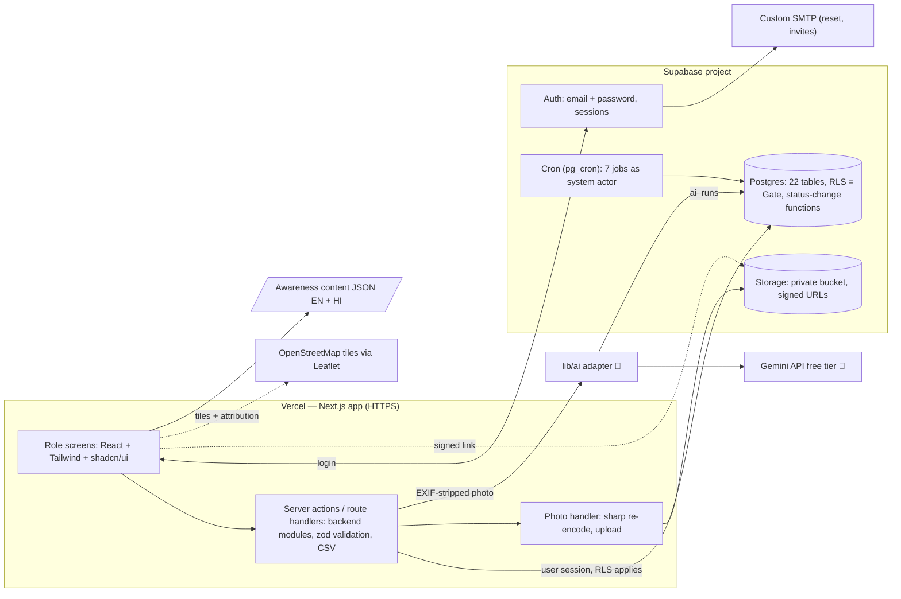

# Tech Stack — Waste Management System

| | |
|---|---|
| **Version** | v1 — 2026-09-30 |
| **Status** | **Final — approved by the team (2026-09-30).** Section 3 lists what the stack must provide. |
| **Builds on** | [02-PRD.md](02-PRD.md) and [03-FULL-APP-FLOW.md](03-FULL-APP-FLOW.md): §1 architecture, §8 data model, §9 jobs, §10 stack requirements |
| **Evidence labels** | **[Doc]** = checked in official documentation (sources in §12) · **[Rec]** = our recommendation · **[Verify]** = confirm during setup |
| **AI update** | v1.1 — 2026-09-30: AI and intelligence features added (🧠); details in [05-AI-SPEC.md](05-AI-SPEC.md) |
| **Split by part** 🆕 | [TECH-STACK/](TECH-STACK/00-FULL-TECH-STACK.md): full overview + 8 detailed part files (frontend, backend, database, auth, storage & photos, AI, background jobs, DevOps). This file stays the decision record (D1–D9, alternatives, sources). |

---

## 1. Recommendation in one line

**Next.js (TypeScript) + Supabase (Postgres, Auth, Storage, Cron) + Leaflet with OpenStreetMap tiles, hosted on Vercel.** [Rec]

It is one codebase for the frontend and backend, and one managed service for the database, login, photos and background jobs. The 22-table relational model and the org-isolation rules fit Postgres directly.

---

## 2. The stack

| Layer | Tool | Why this tool |
|---|---|---|
| Frontend + backend API | **Next.js (App Router), TypeScript** | One app serves every role's screens and the backend modules (server actions / route handlers). Fewer moving parts. [Rec] |
| UI | **Tailwind CSS + shadcn/ui** | Fast, consistent, accessible components; responsive for phone and laptop. [Rec] |
| Database | **Supabase Postgres** | Relational, fits the 22 tables in §8. [Rec] |
| Org isolation + permissions (the Gate) | **Postgres Row Level Security (RLS)** + database functions for status changes | RLS restricts every row a user can read or write; once enabled, no data is accessible until policies exist. [Doc] Status changes go through database functions that check the allowed transitions (§6 of the app flow). [Rec] |
| Login | **Supabase Auth** (email + password) | Hashed passwords stay in the auth service; sessions and tokens included. [Rec] |
| Email (reset, invites) | Supabase Auth email **+ a custom SMTP provider** for real use | The built-in email sends only **2 emails per hour** and only to project team addresses. [Doc] See decision D3. |
| Photos | **Supabase Storage, private bucket** + short-lived signed links | Buckets are private by default; `createSignedUrl` gives time-limited access. [Doc] |
| Photo processing | Resize in the browser before upload; **re-encode on the server with `sharp`** to strip EXIF | Keeps files small and removes hidden GPS data. [Rec] Confirm `sharp` output has no metadata. [Verify] |
| Background jobs (7 jobs, every 15 min / 1 h / daily) | **Supabase Cron (pg_cron)** calling SQL functions | Runs inside the database, from every second to once a year. [Doc] **Not Vercel Cron:** the Hobby plan allows only once-per-day jobs. [Doc] |
| Maps | **Leaflet + react-leaflet**, **OpenStreetMap tiles** | Free, no billing key. The OSM tile policy requires visible attribution; there is no guarantee of availability, and heavy use can be blocked. [Doc] Fine for demo traffic. |
| GPS and camera | Browser **Geolocation** and file/camera input | Built into the browser; needs HTTPS and user permission. [Doc — from our research] |
| Notifications (in-app) | `notifications` table + **polling every ~30 s**; Supabase Realtime as an upgrade (Could) | Polling is simplest and reliable. [Rec] |
| Awareness EN/HI | **Static JSON content file** (EN + HI keys, source per item) | No backend or translation library needed. [Rec] |
| Time zone | `timestamptz` columns (stored as UTC) + `Intl.DateTimeFormat` with the organisation's time zone | Built into Postgres and the browser. [Rec] |
| Validation | **zod** on every server action | Matches "server validates every field". [Rec] |
| CSV export | Route handler builds CSV from an org-scoped query | No extra service. [Rec] |
| Hosting | **Vercel** (frontend + API) · **Supabase** (database, auth, storage, cron) | Both have free tiers suitable for a prototype. [Rec] Check free-tier limits and project pausing at setup. [Verify] |
| Error logs | Vercel function logs + Supabase logs; Sentry deferred | Enough for a prototype; never log passwords or signed links. [Rec] |
| Seed data | SQL seed script + a small script using the Supabase admin API to create demo users | Creates both organisations, all roles and all demo cases. [Rec] |
| **AI photo analyzer** 🧠 | **Google Gemini API, free tier** (team decision), called only from the server through `lib/ai/` | Free input/output on certain models; free-tier content may be used to improve Google's products; limits shown in AI Studio. [Doc] Exact model ID with image input confirmed at setup. [Verify] |
| AI SDK 🧠 | Google's official Gen AI JavaScript SDK [Verify package name], wrapped by our adapter | The adapter keeps the provider switchable (Claude API or Vercel AI Gateway later) by changing one module. [Rec] |
| AI output checking 🧠 | Structured JSON answer validated with **zod**; invalid → *mixed / uncertain* | Keeps the app safe from malformed AI output. [Rec] |
| Intelligence jobs 🧠 | **Supabase Cron**: daily risk scores and performance flags; level-2 escalation in the 15-min job | Same scheduler as the other jobs; rules, not AI. [Rec] |

### 2.1 Added after the tech-stack audit 🆕

Technical needs that the app flow already requires but §2 did not name a tool for.

| # | Need (from the app flow) | Tool | Why this tool |
|---|---|---|---|
| G1 | **QR codes** — scan a location QR to prefill a report (F3.3); scan the disposal-site QR (F9.4b); admins print QR codes for locations and disposal sites (F2.2) | Scan: a browser QR library (for example `html5-qrcode` or `@zxing/browser`) [Verify]; manual code entry as fallback. Generate: `qrcode` npm package on the admin setup page [Verify]. QR value = a random token in `locations.qr_code`, not the row id | The built-in browser barcode API is not available in every browser [Verify]; a library works on phones through the camera. Random tokens cannot be guessed. [Rec] |
| G2 | **Distance on the map** — far-from-site warning (demo 100 m, F4.4), disposal geofence (demo 150 m, F9.4b), unapproved-stop flag, arrival estimate | One SQL function `distance_m(lat1, lng1, lat2, lng2)` using the haversine formula, called inside the status-change functions | Enough accuracy at street scale; no PostGIS needed for a prototype. PostGIS is the upgrade for large data. [Rec] |
| G3 | **Demo reset** — a live demo changes data (cases close, points are given) | `scripts/reset-demo`: clears the two demo organisations, re-runs `seed.sql` and `scripts/seed-users`. Seed times are written relative to `now()` (for example "created 30 h ago") so overdue and escalated cases always look right | Every demo starts from the same known state; no stale dates. [Rec] |
| G4 | **Testing** — the definition of done needs both organisations and every role checked | **Vitest** for pure rules (SLA, risk score, arrival estimate, zod schemas); **Playwright** smoke test per role; **RLS tests** that log in as each role of each organisation and try to read the other organisation's rows (pgTAP through `supabase test db` [Verify]); AI test-set script over ≥ 10 photos per category (05-AI-SPEC §9) | Catches the most harmful mistake (one organisation seeing another's data) before a demo. [Rec] |
| G5 | **Time-zone-aware jobs** — schedule windows, "today" and missed checks are in the organisation's time zone | Jobs compare against `now() AT TIME ZONE organizations.time_zone`; schedule windows stored as local time + the organisation's time zone. pg_cron itself runs in UTC [Verify] | Prevents a ward's 7–9 AM window being checked at the wrong hour. [Rec] |
| G6 | **Per-user AI limit** — protect the free Gemini quota (F10.1b needs login for this reason) | Before each call, count today's `ai_runs` for the user (demo cap 20) and for the organisation (demo cap 200); over the cap → manual choice | Keeps one user from using up the free tier; the app still works without AI. [Rec] |
| G7 | **Developer tooling and release** | **Supabase CLI** (local database, migrations, `supabase gen types typescript` for typed queries); **GitHub** repository in its own project folder; **Vercel Git integration** (preview deploy per branch, production from `main`); ESLint + Prettier + `tsc` | Schema changes are versioned and repeatable; the whole team deploys the same way. [Rec] |
| G8 | **Photo formats and limits** | Accept JPEG, PNG, WebP and iPhone HEIC in the picker; the browser converts to JPEG while resizing (long side ~1600 px, target ≤ 1 MB, demo); server checks the real file type from its first bytes; signed links expire after a short time (demo 10 min) | Server-side HEIC decoding in `sharp` prebuilt binaries may not be available [Verify], so conversion happens in the browser; small files stay under the serverless request limit (D6). [Rec] |
| G9 | **Small but required details** | **Rewards:** points written inside the close status function, at most once per report (unique key), badges computed by query. **Hindi text:** Noto Sans Devanagari through `next/font` [Verify]. **Map:** Leaflet loaded only in the browser (dynamic import without server rendering) because it needs `window`. **CSV export:** cells starting with `=`, `+`, `-` or `@` are escaped | Prevents double points, broken Hindi glyphs, map build errors and spreadsheet formula injection. [Rec] |

---

## 3. Requirement check (app flow §10)

| # | Requirement | Covered by |
|---|---|---|
| 1 | Email/password auth, sessions, reset and invite emails, custom roles | Supabase Auth; roles in `users.role`; email needs custom SMTP for non-team addresses (D3) |
| 2 | Server-side per-record authorization | RLS policies + status-change functions + server actions |
| 3 | Relational database for §8 | Supabase Postgres |
| 4 | Private file storage, signed links, phone upload, EXIF strip | Supabase Storage private bucket + signed URLs; `sharp` on the server |
| 5 | Scheduled jobs every 15 min | Supabase Cron (pg_cron) |
| 6 | HTTPS, GPS, camera, map with pins | Vercel HTTPS; browser APIs; Leaflet + OSM |
| 7 | Aggregation queries, refresh or live updates | SQL views / functions; polling (Realtime optional) |
| 8 | Time zone handling | `timestamptz` + organisation time zone setting |
| 9 | EN/HI awareness | Static JSON content file |
| 10 | Responsive UI, hosting, secrets | Tailwind + shadcn/ui; Vercel environment variables |
| 11 | CSV export | Next.js route handler |
| 12 | Map tiles, error logging | OSM tiles with attribution; Vercel and Supabase logs |
| 13 🧠 | AI model with image input, server-only, switchable | Gemini API free tier via `lib/ai/` adapter; key in `GEMINI_API_KEY` |

| 14 🆕 | QR scan (report prefill, disposal site) and QR generation for admins | Browser QR library + `qrcode` package (G1) |
| 15 🆕 | Distance checks (far-from-site, geofence, unapproved stop) | SQL `distance_m` function (G2) |
| 16 🆕 | Repeatable demo data with times relative to now | `scripts/reset-demo` + relative seed (G3) |
| 17 🆕 | Automated checks of rules, roles and organisation isolation | Vitest, Playwright, RLS tests, AI test-set script (G4) |
| 18 🆕 | Limit AI calls per user and organisation | `ai_runs` daily count check (G6) |

All 13 are covered (13 added for AI 🧠). ✅
Rows 14–18 were added after the tech-stack audit 🆕; all 18 are covered. ✅

---

## 4. Architecture components → tools (app flow §1.6)



| App-flow component | Tool |
|---|---|
| Public pages, role screens, bell, demo label | Next.js pages + React components |
| Auth service | Supabase Auth |
| Gate (5 checks) | 1–2 Supabase Auth session + `users.active`; 3–4 RLS policies on `org_id`, role and ownership; 5 status-change database functions |
| Business modules | Next.js server actions calling Postgres (as the logged-in user, so RLS applies) |
| Photo handler | Next.js route handler + `sharp` + Supabase Storage |
| Scheduled jobs | Supabase Cron → SQL functions; events written with `actor = system` |
| Database | Supabase Postgres |
| File storage | Supabase Storage (private bucket) |
| Email service | Supabase Auth email via custom SMTP |
| Map tiles | OpenStreetMap through Leaflet |
| Error logs | Vercel + Supabase logs |
| Hosting | Vercel + Supabase |
| Seed script | SQL + admin-API script |
| AI adapter 🧠 | `lib/ai/` in Next.js server code → Gemini API |
| Intelligence jobs 🧠 | Supabase Cron → SQL functions |

### 4.1 Tech stack on the full app workflow 🆕

The workflow in app flow §4.0 with the tool that runs each part and why that tool was chosen. Same tools as §2; nothing new is added here. **v2 🆕:** audit items G1–G9 (§2.1) added — build and release, QR, distance, time-zone jobs, AI limit, rewards, demo reset, tests. Solid arrows = requests; dotted arrows = scheduled jobs, links and external calls.

```mermaid
flowchart TD
  %% ===== Build, test and release (G3, G4, G7) 🆕 =====
  subgraph BUILD["🛠️ Build, test and release 🆕"]
    GH["GitHub repository (own project folder) + ESLint / Prettier / tsc<br/>WHY: one versioned source for the team"]
    CLI["Supabase CLI — migrations, local DB, generated TypeScript types<br/>WHY: schema, RLS, functions and cron are versioned and repeatable"]
    CI["Vercel Git integration — preview per branch, production from main<br/>WHY: everyone deploys the same way"]
    TESTS["Vitest (rules) · Playwright (each role) · RLS tests (org isolation) · AI test-set script<br/>WHY: catch cross-org data leaks and wrong rules before a demo"]
    RESET["scripts/reset-demo — re-seed both demo orgs, times relative to now()<br/>WHY: every demo starts from the same state"]
  end

  %% ===== Users and devices =====
  subgraph DEV["📱 Users' phones and laptops — any modern browser"]
    U["Resident · Worker / Driver · Admin · Supervisor · Higher authority 🧠 · Public"]
    BAPI["Browser Geolocation + camera / file input<br/>WHY: built in, no app install; needs HTTPS + permission"]
    RESIZE["Browser image resize before upload<br/>WHY: small files on mobile data"]
    HEIC["Convert JPEG / PNG / WebP / HEIC → JPEG, ~1600 px, ≤ 1 MB (demo) 🆕<br/>WHY: iPhone HEIC may not decode on the server; stays under upload limit"]
    QRSCAN["QR scanner library (e.g. html5-qrcode) + manual code fallback 🆕<br/>WHY: built-in barcode API is not in every browser"]
  end

  %% ===== Frontend =====
  subgraph FE["🖥️ Frontend — Next.js App Router + TypeScript on Vercel"]
    PAGES["Role screens: /my · /worker · /admin · /supervisor · /authority · /awareness<br/>WHY: one codebase for every role, typed end to end"]
    UIKIT["Tailwind CSS + shadcn/ui<br/>WHY: fast, consistent, accessible, responsive for phone and laptop"]
    MAPUI["Leaflet + react-leaflet<br/>WHY: free map with pins, no billing key"]
    AWJSON[/"Awareness content JSON (EN + HI, source per item)<br/>WHY: static page, no backend or translation library"/]
    BELL["Notification bell — polling every ~30 s<br/>WHY: simplest reliable refresh; Supabase Realtime later (Could)"]
    FONT["Noto Sans Devanagari via next/font 🆕<br/>WHY: Hindi text renders correctly on every phone"]
    QRPRINT["Admin setup: printable QR codes (qrcode package) 🆕<br/>WHY: locations and disposal sites need a code to scan"]
  end

  %% ===== Backend =====
  subgraph BE["⚙️ Backend — Next.js server actions + route handlers on Vercel"]
    ZOD["zod validation on every server action<br/>WHY: 'server validates every field'"]
    MODS["Business modules: reports, case lifecycle, pickups, schedules, trips, hotspots, dashboards, CSV export<br/>WHY: same app as the frontend — fewer moving parts"]
    SHARP["Photo handler: sharp re-encode<br/>WHY: strips EXIF location data before storage"]
    AIA["lib/ai adapter 🧠 — classifyWastePhoto(), timeout, zod-checked JSON<br/>WHY: provider switchable in one module; invalid output → mixed / uncertain"]
    AILIM{"AI limit check 🆕 — today's ai_runs per user (demo 20) and org (demo 200)<br/>WHY: protects the free quota; over the cap → manual choice"}
    CSVX["CSV export with formula escaping 🆕<br/>WHY: cells starting = + - @ cannot run in a spreadsheet"]
  end

  %% ===== Supabase =====
  subgraph SB["🗄️ Supabase project"]
    AUTH["Supabase Auth — email + password, sessions<br/>WHY: hashed passwords never touch our code"]
    GATE{"The Gate = Postgres Row Level Security + status-change functions<br/>WHY: session · active · same org · role · allowed transition checked in the database itself"}
    PG[("Supabase Postgres — 22 tables, timestamptz (UTC)<br/>WHY: relational data, joins for dashboards and hotspots")]
    STORE[("Supabase Storage — private bucket + signed URLs<br/>WHY: photos private by default, time-limited links")]
    CRON["Supabase Cron (pg_cron) → SQL functions, actor = system<br/>WHY: runs every 15 min / hourly / daily; Vercel Hobby cron is once per day only"]
    TZ["Time-zone check 🆕 — now() AT TIME ZONE org time zone<br/>WHY: pg_cron runs in UTC; windows are local"]
    DIST["distance_m() SQL function (haversine) 🆕<br/>WHY: far-from-site 100 m, geofence 150 m, unapproved stop — no PostGIS needed"]
    REWARD["Close status function → reward_events, once per report 🧠🆕<br/>WHY: no double points; badges by query"]
  end

  %% ===== External services =====
  subgraph EXT["🌐 External services"]
    GEM["Google Gemini API — free tier 🧠<br/>WHY: free image input for the demo; demo photos only (free-tier data may be used by Google)"]
    OSM["OpenStreetMap tiles<br/>WHY: free; attribution required, best-effort, fine for demo traffic"]
    SMTP["Custom SMTP via Supabase Auth<br/>WHY: built-in email is 2 per hour, team addresses only"]
    LOGS["Vercel + Supabase logs<br/>WHY: enough for a prototype; never log passwords or signed links"]
  end

  %% ===== Workflow steps mapped to tools =====
  U --> PAGES
  PAGES --- UIKIT
  U -->|"F1 sign-up / login"| AUTH
  AUTH -.->|"reset + staff invite email"| SMTP
  AUTH -->|"session token"| GATE
  PAGES -->|"F10 awareness (no login)"| AWJSON

  BAPI -->|"F3 photo + GPS · F4 after-photo + GPS · F9 trip taps"| RESIZE
  RESIZE --> PAGES
  PAGES -->|"form submit"| ZOD
  ZOD --> MODS
  MODS -->|"F3 / F4 photos"| SHARP
  SHARP --> STORE
  SHARP -->|"F3.3c analyzer · F10.1b 'Which bin?'"| AIA
  AIA -.->|"server-only key GEMINI_API_KEY"| GEM
  AIA -->|"suggestion + ai_runs log"| GATE

  MODS -->|"F2 setup · F3 report · F4 lifecycle · F6 pickup · F12 schedule · F9 trip · F7 prevention review"| GATE
  GATE --> PG
  PG -->|"F8 dashboards, F7 top locations, CSV"| MODS
  MODS --> PAGES

  PAGES -->|"F8 admin map · F9 vehicle positions"| MAPUI
  MAPUI -.->|"tiles + attribution"| OSM
  PAGES -.->|"view photo via signed link"| STORE
  BELL -->|"read notifications"| GATE
  PAGES --- BELL

  CRON -.->|"F5 overdue + escalation L1 / L2 · F6 missed pickup → complaint · F12 routine collection missed · F13 risk + performance (daily)"| PG
  MODS -.-> LOGS
  PG -.-> LOGS

  %% ===== Audit additions (G1–G9) 🆕 =====
  GH --> CLI
  GH --> CI
  CI -.->|"deploy"| PAGES
  CLI -->|"migrations: tables, RLS, functions, cron"| PG
  TESTS -.->|"run before every demo"| GATE
  RESET -.->|"re-seed"| PG
  BAPI -->|"photo"| HEIC
  HEIC --> RESIZE
  BAPI -->|"F3.3 location QR · F9.4b disposal-site QR"| QRSCAN
  QRSCAN --> PAGES
  PAGES --- FONT
  PAGES -->|"F2.2 admin setup"| QRPRINT
  SHARP -->|"before each AI call"| AILIM
  AILIM -->|"under cap"| AIA
  MODS -->|"F8 CSV"| CSVX
  GATE -->|"F4.4 far-from-site · F9.4b geofence · unapproved stop"| DIST
  GATE -->|"F4.6 closed as confirmed"| REWARD
  REWARD --> PG
  CRON --> TZ
  TZ -.-> PG
```



**Text version of the same diagram (for slides and quick reading):**

```text
                    USERS (Resident · Worker/Driver · Admin · Supervisor · Higher authority · Public)
                                              |
                  +---------------------------+---------------------------+
                  |                           |                           |
                  v                           v                           v
   +------------------------------+   +-----------------------+   +------------------------------+
   | BROWSER ON PHONE / LAPTOP    |   | SUPABASE AUTH         |   | AWARENESS PAGE (no login)    |
   | Geolocation + camera input   |   | email + password      |   | Static JSON, EN + HI         |
   | Image resize before upload   |   | WHY: hashed passwords |   | WHY: no backend needed       |
   | WHY: no app install          |   | never touch our code  |   +------------------------------+
   +------------------------------+   +-----------------------+
                  |                     |               |
                  |                     |               +----> CUSTOM SMTP (reset, staff invites)
                  |                     |                      WHY: built-in email = 2/hour, team only
                  v                     | session token
   +--------------------------------------------------------------+
   | FRONTEND — Next.js App Router + TypeScript (on Vercel)       |
   | Role screens: /my /worker /admin /supervisor /authority      |
   | UI: Tailwind CSS + shadcn/ui                                 |
   | Map: Leaflet  -------------------------> OpenStreetMap tiles |
   | Bell: polling every ~30 s                (free, attribution) |
   | WHY: one codebase for every role, typed end to end           |
   +--------------------------------------------------------------+
                  |
                  | form submit
                  v
   +--------------------------------------------------------------+
   | BACKEND — Next.js server actions + route handlers (Vercel)   |
   | 1. zod checks every field                                    |
   | 2. Business modules: reports, lifecycle, pickups, schedules, |
   |    trips, hotspots, dashboards, CSV export                   |
   | 3. Photo handler: sharp re-encode (strips EXIF location)     |
   | 4. lib/ai adapter  ------------------> GEMINI API free tier  |
   |    (server-only key, timeout,          WHY: free image input |
   |     invalid output -> mixed/uncertain)  demo photos only     |
   | WHY: same app as frontend = fewer moving parts               |
   +--------------------------------------------------------------+
                  |                                   |
                  | every read / write                | photos
                  v                                   v
   +------------------------------------+   +------------------------------+
   | THE GATE — Postgres RLS +          |   | SUPABASE STORAGE             |
   | status-change functions            |   | private bucket + signed URLs |
   | checks: session, active user,      |   | WHY: photos private by       |
   | same org, role, allowed transition |   | default, time-limited links  |
   | WHY: rules enforced in the DB      |   +------------------------------+
   +------------------------------------+
                  |
                  v
   +------------------------------------+       +------------------------------------+
   | SUPABASE POSTGRES — 22 tables      | <---- | SUPABASE CRON (pg_cron)            |
   | times stored in UTC                |       | every 15 min / hourly / daily:     |
   | WHY: relational data, joins for    |       | overdue + escalation L1/L2,        |
   | dashboards and hotspots            |       | missed pickup -> complaint,        |
   +------------------------------------+       | routine collection missed,         |
                  |                             | risk scores + performance flags    |
                  |                             | WHY: Vercel Hobby cron = 1/day     |
                  v                             +------------------------------------+
     Dashboards, top locations, CSV
     back to the role screens
                  |
                  v
   LOGS: Vercel + Supabase (never log passwords or signed links)

   ADDED AFTER AUDIT (G1–G9, §2.1):
   BUILD:    GitHub -> Supabase CLI (migrations, types) -> Vercel Git deploy
             Tests: Vitest + Playwright + RLS tests + AI test set -> run before every demo
             scripts/reset-demo -> re-seed, times relative to now()
   BROWSER:  HEIC/PNG/WebP -> JPEG <= 1 MB  |  QR scanner library + manual fallback
   FRONTEND: Noto Sans Devanagari (Hindi)  |  admin prints QR codes (qrcode package)
   BACKEND:  AI limit check (ai_runs per user 20 / org 200) -> lib/ai  |  CSV formula escaping
   DATABASE: distance_m() haversine (100 m far-from-site, 150 m geofence)
             reward points once per report in the close function
             jobs compare in the organisation's time zone (pg_cron runs in UTC)

   HOSTING: Vercel = Next.js app (frontend + backend, HTTPS)
            Supabase = database, auth, storage, cron
```

**Hosting:** Vercel hosts the Next.js app (frontend + backend, HTTPS); Supabase hosts the database, auth, storage and cron. Both have free tiers for a prototype. [Verify limits at setup]

---

## 5. Security design with this stack

1. **RLS on every table** in the exposed schema; enable it when creating tables in SQL, because only the dashboard Table Editor enables it by default. [Doc]
2. **Every policy checks `org_id`** against the logged-in user's organisation, then role and ownership (§7 of the app flow).
3. **Status changes only through database functions** (for example `assign_report`, `complete_report`, `return_report`). Each function checks the allowed transition, writes the timeline event and notification, and runs in a single transaction. Direct updates to `status` columns are not allowed by policy.
4. **The service-role key is used only on the server** (seed script, photo upload after checks, jobs). It never reaches the browser.
5. **Photos:** private bucket; object path starts with `org_id/`; storage policies check the organisation; screens receive only short-lived signed URLs.
6. **Secrets** only in environment variables (names in §8), never committed.
7. **AI key and data** 🧠: `GEMINI_API_KEY` is server-only; only the EXIF-stripped, resized photo and the instruction are sent — no names, emails, phones or addresses; demo photos only while on the free tier.
8. **QR tokens** 🆕 are random and stored in `locations.qr_code`; a scanned token is accepted only for a location of the user's own organisation.
9. **CSV export** 🆕 escapes cells that start with `=`, `+`, `-` or `@` (spreadsheet formula injection).
10. **Scheduled jobs** 🆕 run as database functions inside Supabase (no public job endpoint to call).

---

## 6. Key decisions and trade-offs

| # | Decision | Why | Trade-off |
|---|---|---|---|
| D1 | Supabase instead of a custom backend (Express / Django) | Auth, storage, cron and RLS already exist; less code to build and test | Business rules live partly in SQL (policies, functions); the developers must be comfortable with SQL |
| D2 | Supabase Cron instead of Vercel Cron | Vercel Hobby allows jobs only once per day [Doc]; we need 15 min | Job logic is written as SQL functions |
| D3 | **Email for the demo:** create demo users with the seed script (no invite email needed); turn off email confirmation for demo sign-up; show password reset only to a team email address. Add custom SMTP (e.g. a transactional email provider) before any real use | Built-in email: 2 per hour, team addresses only [Doc] | Invite and reset emails to arbitrary users do not work until SMTP is configured |
| D4 | Polling for notifications and dashboards; Realtime as an upgrade | Simplest; works everywhere | Up to ~30 s delay |
| D5 | OpenStreetMap tiles | No key or billing | Best-effort service; attribution required; heavy use not allowed [Doc] |
| D6 | Server-side `sharp` re-encode for EXIF removal | App-flow rule: strip location metadata on the server | Uploads pass through the Next.js server; keep photos small (browser resize first) because serverless request bodies are limited in size [Verify current limit] |
| D7 | Static JSON for awareness EN/HI | No database or translation service needed | Content changes need a redeploy |
| D8 🧠 | Gemini free tier behind a switchable adapter | Free for the demo (team decision); image input [Doc] | Free-tier content may be used by Google [Doc] → demo photos only; limits can change → manual fallback |
| D9 🧠 | Predictions, SLA, performance, dumping checks and rewards as rules and statistics, not AI calls | Explainable, testable, no quota use | Must not be marketed as "AI"; labelled *prediction* or *estimate* |

---

## 7. Alternatives considered

| Option | Why not chosen |
|---|---|
| Firebase (Firestore) | Document database; the 22 related tables, joins and aggregates in §8 fit SQL better [Rec] |
| Express / Django + own Postgres | Auth, storage, signed links and jobs would all need building and hosting separately [Rec] |
| Vercel Cron for jobs | Once per day on Hobby [Doc] |
| Google Maps | Requires an API key with billing [Verify]; OSM is enough for a prototype |
| Supabase Realtime from day one | Adds subscriptions and edge cases; polling is enough first |

---

## 8. Project setup (names only, no values)

**Environment variables**
- `NEXT_PUBLIC_SUPABASE_URL`
- `NEXT_PUBLIC_SUPABASE_ANON_KEY` (Supabase may call this the *publishable* key [Verify])
- `SUPABASE_SERVICE_ROLE_KEY` (server only)
- `GEMINI_API_KEY` (server only) 🧠
- SMTP settings are entered in the Supabase dashboard, not in the app

**Suggested folder structure**
```
app/
  (public)/awareness, login, signup, reset-password
  (resident)/my, report/new, pickup/new, case/[id]
  (worker)/worker, worker/trip
  (admin)/admin, admin/location/[id], admin/map, admin/setup
  (supervisor)/supervisor
  api/photos, api/export
components/          shared UI, map, bell, demo label
lib/                 supabase clients (browser / server), zod schemas, time-zone helpers
lib/ai/              🧠 adapter: classifyWastePhoto(), provider client, prompt, zod output schema
content/awareness.json
supabase/
  migrations/        tables, RLS policies, status functions, cron jobs
  seed.sql           demo organisations, areas, locations, cases, pickups, trips
scripts/seed-users   creates demo users through the admin API
scripts/reset-demo   🆕 clears demo orgs, re-runs seed (times relative to now)
app/(authority)/authority   🆕 higher-authority queue
tests/               🆕 vitest (rules), playwright (roles), rls (org isolation)
supabase/tests/      🆕 pgTAP RLS tests [Verify]
scripts/ai-testset   🆕 runs the AI test photos and reports hazard recall
```

**Versions:** use the current stable release of each tool at setup and record them in `package.json`. [Verify] Node.js 24 LTS on Vercel.

---

## 9. What gets built where

| Part | Where it lives |
|---|---|
| 22 tables, constraints, indexes | `supabase/migrations` |
| RLS policies (org, role, ownership) | `supabase/migrations` |
| Status-change functions (reports, pickups, trips) | `supabase/migrations` |
| 7 jobs | SQL functions + `cron.schedule` in `supabase/migrations` |
| Screens | `app/` |
| Server actions (modules), validation | `app/**/actions.ts`, `lib/` |
| Photo upload, CSV export | `app/api/` |
| Demo data | `supabase/seed.sql` + `scripts/seed-users` |
| Distance function, reward points, time-zone checks 🆕 | `supabase/migrations` |
| QR scan and QR print pages 🆕 | `app/` + `components/` |
| Demo reset 🆕 | `scripts/reset-demo` |
| Tests 🆕 | `tests/`, `supabase/tests/`, `scripts/ai-testset` |

---

## 10. Risks

| Risk | Impact | Mitigation |
|---|---|---|
| Built-in email limits | Reset and invites fail for non-team emails | D3; configure SMTP before real use |
| Free Supabase project pausing when inactive [Verify] | Demo fails to load | Open the app shortly before any demo; check plan limits at setup |
| RLS policy mistake | One organisation sees another's data | Test with both demo organisations and every role before showing |
| RLS on large scans can be slow [Doc] | Slow dashboards | Index `org_id` and status columns; aggregate with SQL functions |
| OSM tile availability | Map tiles missing | Map is secondary; lists still work |
| Serverless request size limit | Large photos fail to upload | Resize in the browser first |
| AI free-tier limits or outage 🧠 | Analyzer unavailable | Timeout + manual category; log in `ai_runs` |
| AI misclassifies, especially hazardous items 🧠 | Wrong category or missed hazard | Editable category, *uncertain* option, hazard recall measured on a test set (05-AI-SPEC §9) |
| Free-tier data use 🧠 | Real photos could be used by the provider | Demo photos only; paid tier or another provider before real use |
| Demo data goes stale or is changed during a demo 🆕 | Overdue / escalated examples disappear | `scripts/reset-demo` with times relative to now (G3) |
| QR scanning fails on a phone or in low light 🆕 | Driver cannot verify disposal | Manual code entry fallback; result stays `no_scan` and is flagged, never blocked (G1) |
| iPhone HEIC photos 🆕 | Upload fails | Browser converts to JPEG before upload (G8) |
| Jobs use the wrong time zone 🆕 | Collections marked missed at the wrong time | Compare in the organisation's time zone; test with the demo schedule (G5) |

---

## 11. Next documents that depend on this

1. **Physical schema** — SQL for the 22 tables, RLS policies (done: 06-PHYSICAL-SCHEMA.md) and status functions.
2. **API contract** — server actions and route handlers with inputs, outputs, errors and roles.
3. **Build plan** — ordered build tasks.

---

## 12. Sources checked (2026-09-30)

- Supabase — Row Level Security: https://supabase.com/docs/guides/auth/row-level-security
- Supabase — Cron: https://supabase.com/docs/guides/cron · Quickstart: https://supabase.com/docs/guides/cron/quickstart
- Supabase — Storage buckets (private by default, signed URLs): https://supabase.com/docs/guides/storage/buckets/fundamentals
- Supabase — Auth rate limits (2 emails/hour with built-in provider): https://supabase.com/docs/guides/auth/rate-limits
- Supabase — Custom SMTP (built-in server sends only to team addresses; not for production): https://supabase.com/docs/guides/auth/auth-smtp
- Supabase — Billing FAQ (free projects, pausing): https://supabase.com/docs/guides/platform/billing-faq
- Vercel — Cron jobs usage and pricing (Hobby: once per day): https://vercel.com/docs/cron-jobs/usage-and-pricing
- OpenStreetMap Foundation — Tile Usage Policy: https://operations.osmfoundation.org/policies/tiles/
- Google — Gemini Developer API pricing (free tier, data use): https://ai.google.dev/gemini-api/docs/pricing
- Google — Gemini API rate limits: https://ai.google.dev/gemini-api/docs/rate-limits
- Vercel — AI Gateway pricing (free tier credit): https://vercel.com/docs/ai-gateway/pricing

Everything marked [Rec] is our engineering recommendation, not a measured result. Items marked [Verify] must be confirmed during setup.
