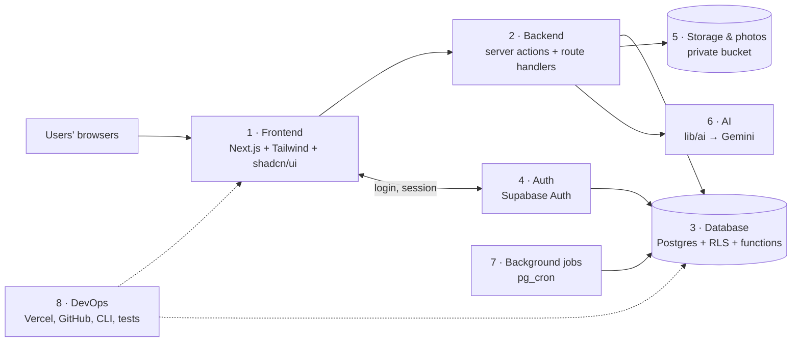

# Full Tech Stack — Overview of All Parts

| | |
|---|---|
| **Version** | v1 — 2026-09-30 |
| **Status** | **Final — stack approved by the team (2026-09-30).** Split from [../04-TECH-STACK.md](../04-TECH-STACK.md) (which stays the decision record: decisions D1–D9, alternatives, sources). |
| **Evidence labels** | **[Doc]** = checked in official documentation (sources in 04 §12) · **[Rec]** = our recommendation · **[Verify]** = confirm during setup · **(demo)** = sample value · 🆕 = named for the first time while splitting (review list in §5) |

---

## 0. Rule for every developer

**Before writing code for any part, cross-check first.** Each part file starts with the same checklist:

1. Read **this file** (the full stack) and [../04-TECH-STACK.md](../04-TECH-STACK.md).
2. Compare them with the part file you are about to use: is any tool, rule, limit or feature for that part missing from it?
3. Cross-check with the full product documents: [../02-PRD.md](../02-PRD.md), [../03-FULL-APP-FLOW.md](../03-FULL-APP-FLOW.md) (flows F1–F13, §3 global rules, §7 permissions), [../05-AI-SPEC.md](../05-AI-SPEC.md), [../06-PHYSICAL-SCHEMA.md](../06-PHYSICAL-SCHEMA.md).
4. **If something is missing:** add it to the part file (mark 🆕, log it in the project change log), then implement it. **If nothing is missing:** implement.
5. **If two documents disagree:** stop and ask the team; do not guess. Never delete text from a document without asking the project owner first.

---

## 1. The stack in one line

**Next.js (TypeScript) + Supabase (Postgres, Auth, Storage, Cron) + Leaflet with OpenStreetMap tiles + Gemini API (free tier) behind a switchable adapter, hosted on Vercel.** [Rec]

---

## 2. The 8 parts

| # | Part | File | Owns |
|---|---|---|---|
| 1 | Frontend | [01-FRONTEND.md](01-FRONTEND.md) | Every screen, component, form, map, camera, GPS, QR scan and print, photo resize, notification bell, language toggle, labels |
| 2 | Backend | [02-BACKEND.md](02-BACKEND.md) | Server actions, route handlers, validation, business modules, calling database functions, error messages, CSV, logging |
| 3 | Database | [03-DATABASE.md](03-DATABASE.md) | Postgres, 22 tables, status-change functions, access rules (RLS), grants, indexes, audit log, seed data |
| 4 | Authentication & authorization | [04-AUTH.md](04-AUTH.md) | Sign-up, login, logout, reset, sessions, roles, the 5-check gate, staff accounts, deactivation, keys |
| 5 | Storage & photos | [05-STORAGE-PHOTOS.md](05-STORAGE-PHOTOS.md) | Photo formats, resize, EXIF stripping, private bucket, paths, signed links, cleanup |
| 6 | AI | [06-AI.md](06-AI.md) | Gemini photo analyzer, adapter, output checking, limits, `ai_runs`, privacy, AI testing; what is **not** AI |
| 7 | Background jobs | [07-BACKGROUND-JOBS.md](07-BACKGROUND-JOBS.md) | The 7 scheduled jobs, time zones, job health |
| 8 | DevOps | [08-DEVOPS.md](08-DEVOPS.md) | Hosting, environments, secrets, GitHub, deploys, local setup, migrations, tests, demo reset, pre-demo checklist |

The full workflow diagram with every tool and "why" is in [../04-TECH-STACK.md §4.1](../04-TECH-STACK.md).

---

## 3. Full inventory — every tool, and which part file details it

| Tool / rule | Part | Status |
|---|---|---|
| Next.js App Router + TypeScript | 1, 2 | [Rec] |
| React (with Next.js) | 1 | [Rec] |
| Tailwind CSS + shadcn/ui | 1 | [Rec] |
| lucide-react icons (shadcn/ui default icon set) | 1 | 🆕 [Rec] [Verify] |
| Leaflet + react-leaflet, loaded in the browser only | 1 | [Rec] (G9) |
| OpenStreetMap tiles with visible attribution | 1 | [Doc] |
| Browser Geolocation + camera / file input (HTTPS) | 1 | [Doc] |
| Browser resize to JPEG ~1600 px, ≤ 1 MB (demo) | 1, 5 | [Rec] (G8) |
| HEIC conversion in the browser (library such as `heic2any` when the browser cannot decode HEIC) | 1, 5 | 🆕 [Verify] |
| QR scanner library (`html5-qrcode` or `@zxing/browser`) + typed-code fallback | 1 | [Verify] (G1) |
| `qrcode` package for the printable QR sheet | 1 | [Verify] (G1) |
| Noto Sans Devanagari via `next/font` | 1 | [Verify] (G9) |
| Awareness content JSON (EN + HI, source per item) | 1 | [Rec] (D7) |
| Language choice remembered in browser storage | 1 | [Rec] |
| `Intl.DateTimeFormat` with the organisation's time zone | 1, 2 | [Rec] |
| Notification bell polling ~30 s; Supabase Realtime later (Could) | 1 | [Rec] (D4) |
| Server actions + route handlers (Node.js runtime) | 2 | [Rec] |
| zod (shared schemas: forms, server actions, AI output) | 1, 2, 6 | [Rec] |
| `@supabase/supabase-js` + `@supabase/ssr` (cookie sessions in Next.js) | 2, 4 | 🆕 [Rec] [Verify] |
| `sharp` re-encode (EXIF stripping) | 2, 5 | [Rec] [Verify] |
| CSV export route with formula escaping | 2 | [Rec] (G9) |
| Vercel + Supabase logs; Sentry deferred | 2, 8 | [Rec] |
| Supabase Postgres, 22 tables | 3 | [Rec] |
| Row Level Security + column grants | 3, 4 | [Doc] |
| Status-change functions (only way to change cases) | 3 | [Rec] |
| `distance_m()` haversine SQL function | 3 | [Rec] (G2) |
| Rewards once per report (unique key) | 3 | [Rec] (G9) |
| `admin_audit_log` via triggers | 3 | [Rec] (06 F3) |
| Supabase Auth, email + password | 4 | [Rec] |
| Built-in email (2/hour, team only) → custom SMTP before real use | 4 | [Doc] (D3) |
| Next.js middleware for session refresh and role redirect | 4 | 🆕 [Rec] [Verify] |
| Service-role key: server only, fixed list of uses | 4, 2 | [Rec] |
| Supabase Storage private bucket + signed links (demo 10 min) | 5 | [Doc] |
| Photo path rule `<org_id>/reports/<report_id>/…` | 5 | [Rec] (06 S2) |
| Google Gemini API, free tier (model ID confirmed at setup) | 6 | [Doc] [Verify] (D8) |
| Google Gen AI JavaScript SDK (package name confirmed at setup) | 6 | [Verify] |
| `lib/ai/` adapter `classifyWastePhoto()`, timeout 8 s (demo) | 6 | [Rec] |
| AI daily limits: 20 per user, 200 per organisation (demo) | 6 | [Rec] (G6) |
| Supabase Cron (pg_cron), 7 jobs, UTC schedules, local-time checks | 7 | [Doc] (D2, G5) |
| `get_job_health()` from pg_cron run history | 7 | [Verify] (06 I6) |
| Vercel hosting (Hobby) + Supabase (Free) | 8 | [Rec] [Verify limits] |
| Node.js 24 LTS | 8 | [Rec] |
| GitHub repository in its own project folder | 8 | [Rec] (G7) |
| Vercel Git integration (preview per branch, production from `main`) | 8 | [Rec] (G7) |
| Supabase CLI: local database, migrations, generated types | 3, 8 | [Rec] (G7) |
| ESLint + Prettier + `tsc` | 8 | [Rec] (G7) |
| Vitest, Playwright, RLS tests (pgTAP [Verify]), AI test-set script | 8 (+3, 6) | [Rec] (G4) |
| PGlite schema smoke test (already written, 57 checks) | 8, 3 | [Rec] |
| `scripts/seed-users`, `supabase/seed.sql`, `scripts/reset-demo` | 3, 8 | [Rec] (G3) |

---

## 4. Coverage check — nothing from 04 is lost

| 04-TECH-STACK section | Now detailed in |
|---|---|
| §1 one-line recommendation | this file §1 |
| §2 stack table (all 23 rows) | inventory §3 above → parts 1–8 |
| §2.1 G1 QR · G2 distance · G3 demo reset · G4 testing · G5 time-zone jobs · G6 AI limit · G7 tooling · G8 photo formats · G9 details | 1 (G1, G8, G9) · 3 (G2, G9) · 8 (G3, G4, G7) · 7 (G5) · 6 (G6) · 5 (G8) · 2 (G9 CSV) |
| §3 requirement check rows 1–18 | each part file's "requirements covered" line |
| §4 components → tools, §4.1 workflow diagram | stays in 04; parts diagram in §2 above |
| §5 security items 1–10 | 3 (1–3), 4 (4, 6), 5 (5), 6 (7), 3 (8), 2 (9), 7 (10) |
| §6 decisions D1–D9 | stay in 04; referenced in the parts that follow them |
| §7 alternatives | stay in 04 |
| §8 environment variables and folder structure | 8 (variables), each part (its folders) |
| §9 what gets built where | each part file's "where it lives" |
| §10 risks | each part file's risks section |
| §12 sources | stay in 04 |

---

## 5. Named for the first time while splitting 🆕 (approved with the stack, 2026-09-30)

These are not new features. Each one is a tool or a page that the existing flows already need but the stack had not named.

| # | Item | Why it is needed | Part |
|---|---|---|---|
| N1 | `@supabase/ssr` + `@supabase/supabase-js` | Keeps the Supabase login session in cookies so server actions run as the logged-in user (RLS applies) [Verify package names] | 2, 4 |
| N2 | Next.js middleware | Refreshes the session and sends each role to its home screen | 4 |
| N3 | HEIC conversion library (e.g. `heic2any`) | G8 says the browser converts HEIC, but only some browsers can decode it themselves [Verify] | 1, 5 |
| N4 | lucide-react icons | shadcn/ui components use it by default [Verify] | 1 |
| N5 | Pages `/pickup/[id]` (pickup timeline, D1), `/admin/trips` (F9.1 trip planning), `/admin/flags` (F13.3), `/admin/audit` (setup history), `/update-password` (F1.4 reset link target) | The flows describe these screens; the folder list in 04 §8 did not name them | 1 |
| N6 | Node.js runtime for photo and AI routes | `sharp` needs Node.js, not the Edge runtime [Verify] | 2 |
| N7 | Supabase region close to users (e.g. Mumbai) | Lower delay for Indian demo users [Verify availability on the free plan] | 8 |

---

## 6. One clarification found while splitting

04 §5 item 5 says "storage policies check the organisation". The tested schema (06 §10, audit S2) uses **no storage policies for users at all**: only the server uploads and creates signed links, and the database functions check that the photo path belongs to the user's organisation and report. The effect is the same (organisation isolation) and stricter. [05-STORAGE-PHOTOS.md](05-STORAGE-PHOTOS.md) follows the 06 approach. The 04 wording was not changed; approve if it should be updated.
