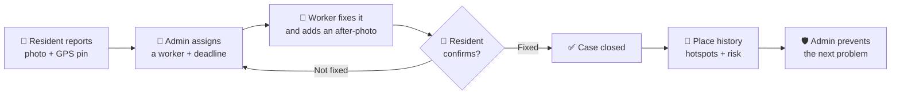
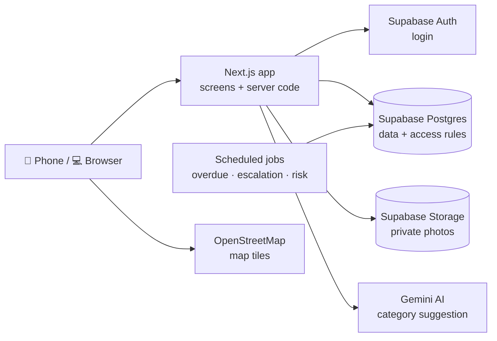

# SWMS — Smart Waste Management System

**Most waste apps stop at "complaint submitted." SWMS closes the loop.** Every report is pinned to a place, assigned to a worker, and closed only with photo proof and the resident's confirmation. The history of each place shows admins where problems keep coming back, so they can prevent them instead of only reacting.

> **Status:** in development. Design, documentation and database schema are complete; the app's home page is built; the other screens and the backend are being built now. All organisations, people, places and cases in the app are **sample data**.

---

## Try the live demo

**Website:** **https://swms-smart-waste.vercel.app**

Two sample organisations are set up with staff accounts so you can see how the app works from each side. Everything in them is **sample data** and may be reset at any time.

### Staff demo accounts

**Password for every account below:** `ujjwal@123@`

| Organisation | Role | Login email | Staff ID |
|---|---|---|---|
| City Ward A | Administrator | `admin@citywarda.demo` | `CWA-ADM-001` |
| City Ward A | Worker — driver | `worker1@citywarda.demo` | `CWA-DRV-001` |
| City Ward A | Worker — waste collector | `worker2@citywarda.demo` | `CWA-COL-001` |
| Green Residency Society | Administrator | `admin@greenresidency.demo` | `GRS-ADM-001` |
| Green Residency Society | Worker — driver | `worker1@greenresidency.demo` | `GRS-DRV-001` |
| Green Residency Society | Worker — waste collector | `worker2@greenresidency.demo` | `GRS-COL-001` |

### How to log in

1. Open the website and choose **Log in**, then pick **who you are**.
2. **Administrator** — enter the **Staff ID**, **login email** and **password**. You land on the admin dashboard (cases, map, duty roster, vehicle trips, analytics, setup).
3. **Worker** — choose the **organisation** and the **block / area you are working in today**, then enter the **Staff ID**, **login email** and **password**. You land on today's work (duties, tasks, live vehicles; drivers can start a trip).

### Residents — use your own email

There is **no shared resident account**. To try the resident side, choose **Sign up → Resident**, register with **your own real email address (for example your Gmail)**, pick an organisation and home area, then report an issue or request a pickup and follow it to the end.

> Please do not enter real addresses, phone numbers or photos of people — this is a demo.

---

## 1. The problem

Cities, colleges, residential societies and public places produce a lot of waste every day, and collection is managed by hand. This leads to:

- overflowing bins
- missed or late pickups
- poor segregation (wet, dry and hazardous waste mixed)
- no easy way to report a problem, and no way to see whether it was fixed

Admins have no central data, so they cannot spot hotspots, monitor complaints or improve the service.

**The core issue is a broken feedback loop.** After a report, nothing visible happens: nobody is clearly responsible, there is no proof of the fix, nothing escalates when it is late, and the same spot keeps overflowing without anyone noticing the pattern. When people never see results, they stop reporting. *(This is our working explanation, not a measured finding.)*

---

## 2. Our solution — close the whole loop



If a case passes its deadline, it is flagged and escalated automatically: **admin → supervisor → higher authority**.

---

## 3. What makes it different

| Typical complaint app | SWMS |
|---|---|
| Stops at "complaint submitted" | Follows the case to the fix, the proof and the resident's confirmation |
| Admin marks "resolved" with one click | Cannot close without the worker's after-photo |
| Nothing happens when it is late | Automatic overdue flag and two-level escalation |
| Shows single tickets | **Place-level history**: hotspots and a next-day risk score for each location |
| No role for the worker | Worker / driver view with tasks and trips |
| AI decides the category | AI only **suggests**; a person always decides |
| Photos are public | Private photos, time-limited links, hidden GPS data removed from images |

*We compared a set of existing apps; we do not claim worldwide uniqueness.*

---

## 4. Features

**Six core features**

| # | Feature | What it does |
|---|---|---|
| 1 | Registration & login | Email + password; each role lands on its own home screen |
| 2 | Report waste issues | Photo, GPS pin (draggable), waste category; AI suggests the category |
| 3 | Waste pickup request | Choose a date and time slot; scheduled → collected / missed / refused |
| 4 | Complaint tracking | Timeline, before/after photos, feedback, reopen within a short window |
| 5 | Admin dashboard | Counts, map, hotspots, overdue cases, worker performance |
| 6 | Waste awareness | Segregation guide in English and Hindi, with a source for every item |

**Extra features**

- Deadlines and automatic escalation for every case
- Missed pickup automatically creates a linked complaint
- QR codes on bins and locations for quick reporting
- Simulated vehicle trips, arrival estimate and a check that waste reached the approved dumping site
- Hotspot risk score (labelled as a prediction from sample data)
- Points and badges for verified reports (no cash)
- One system for many organisations — a city ward and a residential society in the demo — with each organisation's data kept separate

**Roles:** Resident · Worker / Driver · Admin · Supervisor · Higher authority

---

## 5. How it works (architecture)



- The **database decides who can see what** (Row Level Security): a user only ever receives the rows their role and organisation allow.
- **Every case change goes through one database function** that checks the role, the organisation and the allowed status change, and writes the timeline and notifications in the same step.
- **Scheduled jobs** run inside the database every 15 minutes (overdue, escalation, missed pickups) and daily (hotspot risk, performance).

---

## 6. Tech stack

| Tool | Used for | Why |
|---|---|---|
| **Next.js + TypeScript** | Screens and server code in one project | One codebase, fast to build |
| **Tailwind CSS + shadcn/ui** | User interface | Clean, accessible components |
| **Supabase Postgres** | Database (22 tables) | Relational data fits place → cases → events |
| **Row Level Security** | Access control | Enforced by the database itself |
| **Supabase Auth** | Login, sessions, password reset | Built in |
| **Supabase Storage** | Private photos with time-limited links | Photos of homes and streets stay private |
| **pg_cron** | 7 scheduled jobs | Runs inside the database |
| **Gemini API** | Waste category suggestion | Behind a small adapter, so it can be replaced |
| **Leaflet + OpenStreetMap** | Maps | Free, no key needed |
| **Vercel** | Hosting with HTTPS | Phone camera and GPS need HTTPS |

---

## 7. Run it locally

Requirements: **Node.js 20.9 or newer** (24 LTS recommended).

```bash
cd swms-app
npm install
npm run dev
```

Open **http://localhost:3000**. Only the home page exists so far; it needs no keys.


## 8. Repository map

```
├── README.md                      ← you are here
├── DOCUMENTATION/
│   ├── 02-PRD.md                  features, acceptance checks, requirements
│   ├── 03-FULL-APP-FLOW.md        every screen and flow, diagrams, permissions, data model
│   ├── 04-TECH-STACK.md           tools, decisions, security, risks
│   ├── 05-AI-SPEC.md              AI and automation features and their limits
│   ├── 06-PHYSICAL-SCHEMA.md      full database SQL and test results
│   └── TECH-STACK/                the stack split into 8 parts (frontend … devops)
└── swms-app/                      the Next.js application
```

**Where to start reading:** this README → 03-FULL-APP-FLOW §4.0 (the full workflow diagram) → 02-PRD.

---

## 9. Honest limits

- Runs on **sample data**; it has not been tested with a real municipality or society.
- The risk score and performance flags are simple statistics on sample data, not validated predictions.
- Photos support a review; they do not prove that a problem was solved.
- Phone GPS can be faked; distance checks raise warnings, not proof.
- Deadlines and limits shown are demo settings, not official service standards.

---

© 2026 SWMS team. All rights reserved. Shared for review only; no reuse without written permission. See [LICENSE](LICENSE).
